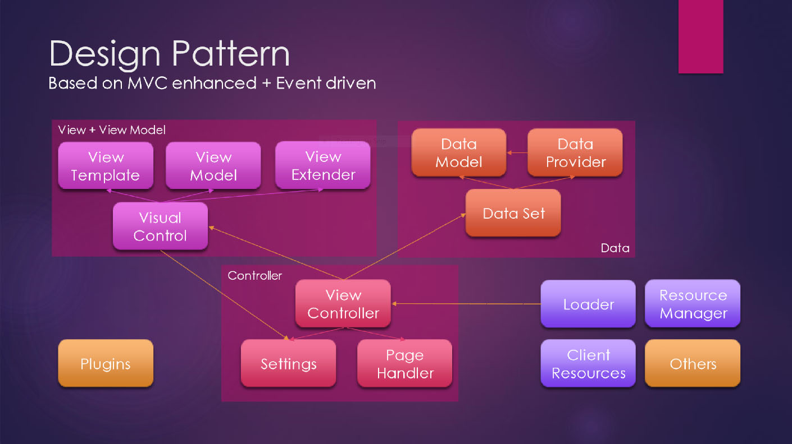

# Quark

A JavaScript library that helps you to create rich web apps with low cost to build and maintain.

- MVC - Model by data set, View by visual controls, Controller by view controllers and page controllers.
- Extended MVVM mode including data models, view templates, view extenders, view models.
- Self-adaptive for mobile, desktop and TV.
- Asynchronous modules loader supports.
- Web-components.



## CDN

```
https://g.alicdn.com/hub/quark/1.8.1000/scripts/index.min.js
```

## See also

- [Tutorial](https://12dlabs.github.io/quark)
- [GitHub Repository](https://github.com/12dlabs/quark)
