# 创新客户端开发架构

> 爱奇艺 PC 端软件再次华丽蜕变

## 前言

看着大家在移动端玩得风生水起，传统的 PC 端仍旧有它不可或缺的存在理由，无论是面向企业办公，还是打造顶级娱乐和游戏，我们都会一如既往地继续投资 PC 端软件的研发。然而，由于一些开发和发布的模式原因，以及历史惯性所致，导致传统PC端软件在产品迭代上略显迟缓。有什么办法来解决这个问题吗？解决这个问题的过程本身，又会遇到什么新的问题吗？

爱奇艺是国内领先的视频平台，秉承着悦享品质的理念。其 PC 客户端拥有极大规模的日活跃用户量，并占据着视频领域极大桌面市场份额。其承载着大量信息资源，需进行合理适当的分发，对内容的呈现速度和更新频次也有着非常高的要求。同时，对软件的更新要求及时，但又希望不要打断用户。

### 需求

爱奇艺 PC 客户端拥有青春版和经典版（即原先的 PPS 客户端）两款，现实中，我们还希望通过完全一致的源代码和程序包，仅通过外部参数控制，来实现两者之间的高度复用。在该客户端中，主要是由许多频道构成了一级页面，每个页面都拥有自己所需展现的大量内容，且无论是展现形式还是数据内容都非常丰富，交互和跳转上也有着丰富的逻辑，同时，可能会在不同时段对这些进行调整。

另一方面，对于软件更新的要求，正如前面所言，也是非常苛刻的。

### 面临的挑战

- 快速迭代
- 功能
- 性能

互联网时代，对软件更新的速度和模式提出了更为苛刻的要求，传统PC端软件已较难应付此挑战，后者通常更新速度较慢，且会导致对用户当下使用的干扰，或是会存在常驻后台更新机制，总体体验较差。

而对于 Web 前端技术，本地资源的使用以及对性能的要求，却成为了大型应用的瓶颈。

### 解决方案概要

针对于传统 PC 端软件和 Web 前端技术所面临的挑战，Web Native 应运而生，可以非常好地解决这些问题。Web Native 即为将 Web 前端绕过浏览器而运行直接于 Native 之上的一种客户端架构概念，其包含多种具体的框架方案。目前爱奇艺 PC 客户端采用的是 Facebook 提出的 React Native 框架，并对其进行了针对性的调整和二次开发，以适应 Windows 平台和特定的场景。

基于 Web Native 的开发，解决了性能、开发、更新等诸多关系之间的平衡；通过提出并大规模应用爱奇艺 XCard 等技术，在保持用户使用品质的前提下，大幅提升运营等对内容和版式等的充分控制能力和响应速度，同时保证未来的业务适应和扩展能力。

- 得益于类 Web 开发技术，我们在软件开发过程更为迅速，从而实现真正意义上的快速迭代，界面调试也更为简单。
- 由于打包更为轻便，快速分发成为可能。只需将打包后的程序集部署在线上，客户端即可自动替换本地，如此简洁的更新方式直接促成高效率，而且不会产生阻断式体验。
- 由于界面呈现等技术直接转译/映射为原生代码，且程序集运行于本地，效率远高于 Web 应用，与本地 Native 程序无限接近。
- 在实现这一切的时候，由于其本身的特殊性，还会遇到一些传统客户端程序和普通 Web 应用不一定会遇到的问题，因此也需要针对性的逐一解决。
- 传统应用程序对于会话中上下文的依赖性，要远高于 Web 应用，因此，整个PC端软件的大部分核心功能，被设计为一个单页面应用是非常重要的，考虑到应用程序本身的规模可能较大，良好的路由和架构显得尤为重要。
- 在设计整体架构时，应当尽可能对其中各页面进行抽象处理，提升页面各模块的可复用性，并确保各页面和较大展示模块中，拥有极高的配置能力，从而为日后的运营更新提供更为灵活的施展空间，并由此可以大幅精简因页面多样性而带来的业务代码量。
- 注意对底层接口调用封装的通用性，并尽可能将业务逻辑放在 Web Native 层处理，以避免因接口开放不足而造成仍需升级底层框架。

由此，一个兼具 Web 和 Native 有点的 PC 端软件，也就应运而生了。

## Web Native 架构

Web Native 的优势集合了 Web 前端和 Native 的部分优势，即：灵活、高效、跨平台、底层扩展。

- Web 前端的界面
  - 开发的高效性
  - 发布的灵活性
  - 跨平台
- Native
  - 底层支持能力
  - 运行时的高效性
  - 本地包

### 基本架构

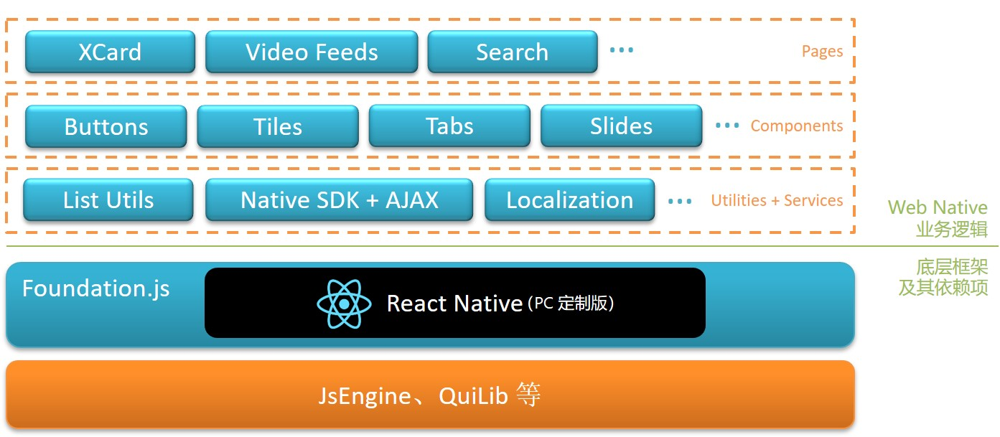

当前 PC 客户端 Web Native 的整体架构，包含底层框架和上层业务两个层级。

- 底层框架包括由 C++ 等实现的底层视图、JavaScript 渲染引擎、通知等模块，其中，部分基于 Chrome V8 引擎。在该层之上，封装了一些 JavaScript 类库，包括 React Native 和其它业内常用库，以及 JavaScript 与底层通信和控件映射的基础实现。
- 上层业务即为 PC 客户端 Web Native 的业务主体，包括辅助层、控件层和页面层。其中，辅助层包括数据结构、算法、Native 交互、AJAX、缓存、全球化和本地化、样式等服务和工具；控件层包括公共控件、业务控件、业务逻辑转换器；页面层包括各页面的组织管理和页面控件；除此之外，还有数据模型等其它部件类型。

### 渲染机制

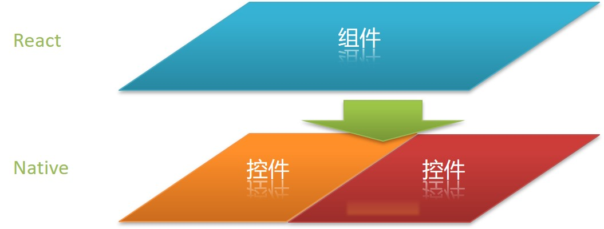

React Native 主要包含以下两个特征。

- 将 React 组件映射为 Native 控件，在这其中，Virtual DOM 发挥了许多作用，因为这一层的封装，使得这层映射更为直接自然；
- 提供了 Native 额外的一些特性。

因此，简单来说，在渲染实现方面，我们可以将 Web 组件通过映射的形式，转换成 Native 层的一个或多个控件，并将事件和属性进行映射绑定，从而实现两者的转换和交互。当然，现实中还是会有许多细节需要考虑的，例如动效等。

目前，React Native 并不支持 CSS 和 HTML 原生 DOM，并且还存在一些其它限制，因此并不能发挥出所有 Web 的特性。但考虑到其所拥有的 Native 的一些特性，我们认为这些少量牺牲是值得的。

### 加载原理

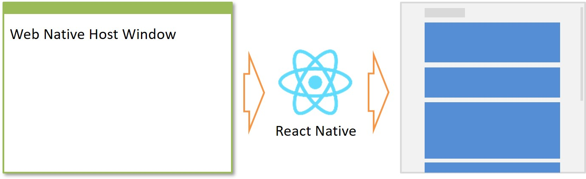

在需要运行 Web Native 页面时，由应用程序唤起 Web Native 宿主窗口。该窗口通过 JavaScript 渲染引擎和渲染器等，加载前端入口脚本，该脚本会引用 React Native 前端框架库和其它框架，并调用 React Native 前端框架库的前端应用注册渲染方法来加载 Web Native 页面。

而后，Web Native 与宿主窗口的交互主要通过通知机制。

### 软件迭代

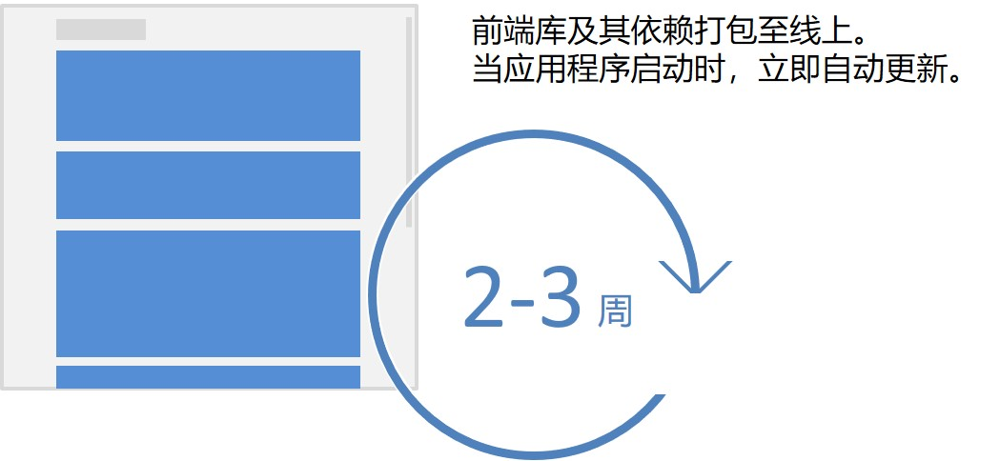

软件的更新现在变得非常非常便捷，省去安装升级等传统步骤。

1. 对前端库及其依赖项进行打包压缩后，即可发布至线上，并设定于版本绑定关系。
2. 客户端应用程序在启动后，先检查是否由更新，有则下载该前端包并解压。
3. 客户端应用程序随即使用本地的前端包。

由于前端库并不含运行时，且对依赖项会进行整合压缩，因此前端包本身体积较小，下载过程也几乎会能在瞬间完成。

由此，迭代和更新发布频次也可以随之大幅提升。通常，爱奇艺 PC 客户端前端包仅2至3周即可更新一次，且每次更新都可以做到立即全网覆盖。即便用户当下没有开启客户端应用程序，在下次启动的时候，也会立即看到最新版。整体体验顺滑无缝。

## XCard

Web Native 解决了最基础的问题。然而，在此基础之上，当业务随之庞大之后，该如何通过技术驱动，去做到更好的突破呢？我们通过采用爱奇艺 XCard 技术，非常好地解决了我们在进一步的性能、功能、运营等方面的各项需求。

### 什么是 XCard？

考虑到爱奇艺 PC 客户端软件中，包含了大量展示型页面，这些展示型页面承载了海量的视频资源入口，并且这些页面的内容的呈现形态非常丰富，每个页面也都不尽相同。

以往，针对每个页面进行定制制作，往往会耗费大量工程师资源，这种成本的消耗其实是非常浪费的。并且，由于每个页面是相互独立的，其之间可能只是组件级复用，这也会导致页面见在联动方面和页面间切换的性能加速等方面，需要依托更上一层的控制器来处理，甚至其它更容易产生耦合的技术来实现，这无疑使得整体更为复杂。

事实上，当我们对所有页面进行梳理时，其实还是可以发现许多共同点的。例如，在爱奇艺 PC 客户端中的这些视频推荐页面，其都是由许多横向排列的通栏组成。为此，我们将这一类的页面定义为了 XCard 页面，其中的所有通栏均为一个 Card，每个 XCard 页面都由多个 Card 构成，而每个 Card 的显示方式和包含数据都不尽相同。

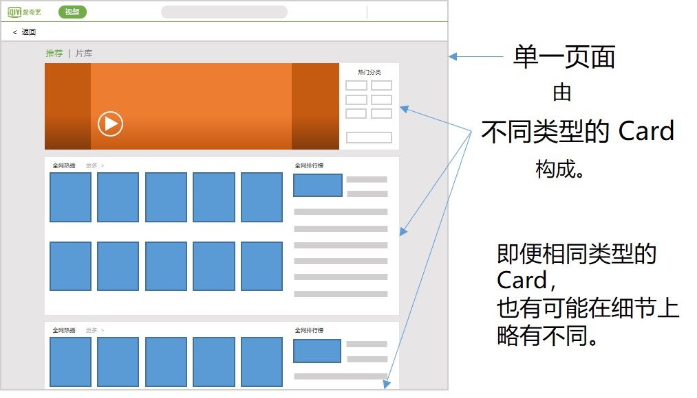

为了让 Card 能支持多种呈现形态，我们定义了一些 Card 类型，为了控制类型不至于泛滥，每种类型代表了一种大的呈现形态种类。然而，由于实际中，每个种类其实还是会存在许多细微差异的，因此我们还定义了 Card 需要支持额外的选项，以进行细节上的配置。通过这两层的控制，从而实现了 Card 的多样化。目前，爱奇艺 PC 客户端拥有数十种 Card 类型，每种类型均支持其特定的选项控制，其中有一些通过不同选项的排列组合，支持数百种不同细节形态的控制。

### XCard 页面加载

在 XCard 页面被加载时，无论是否在线，均会先读缓存，再访问线上数据。具体渲染时，视情况不同而方式不同：若为非 XCard 页面切换至 XCard 页面，会分批渲染；XCard 页面之间进行切换，则逐 Card 更新（又称 Delta Update，该机制会在下一节中介绍）。

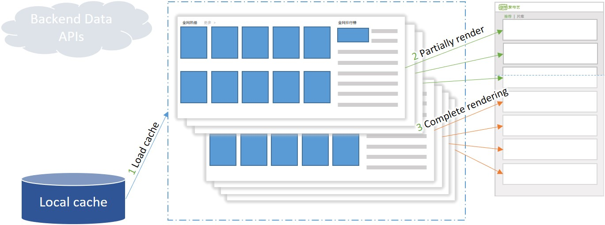

如果缓存可用，则先从缓存读取数据，并解析成 Card，随后先加载首屏画面所需展示的各 Card，待渲染完成后，再去渲染剩余内容，从而保证及时性和流畅度。

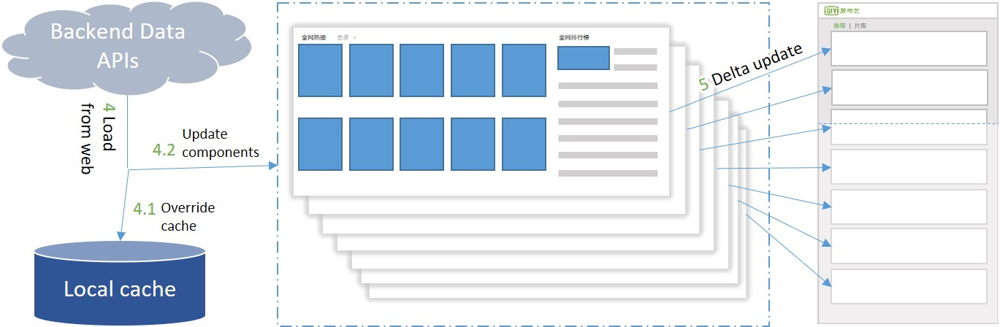

当缓存数据被加载后，随后会去尝试请求线上数据。该数据一方面会去覆盖原缓存数据，另一方面会被解析成 Card，并对界面进行逐 Card 更新渲染。

由于渲染的调度控制是异步的，为了防止出现可能存在的多个渲染操作的冲突，每个渲染均做了时序控制处理，具体实现方式是：在渲染时，会在 XCard 页面中的渲染次引用中创建一个空对象，随后在渲染过程中会去检测这个新创建的对象是否与该引用相同，如果有新的渲染被执行，则该引用会被另一空对象替代，因此会发现不匹配，即当前渲染处于过时状态，便可以随即中止，而新的渲染则会正常地进行下去。

出于对卓越性能的追求，针对不同 XCard 页面之间的切换，我们也做了优化处理。

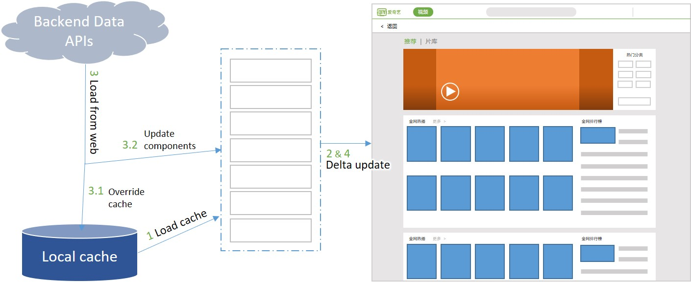

数据流的操作依旧时先缓存后线上，但在渲染过程，则统一采用逐 Card 更新的机制进行。

### 逐 Card 更新

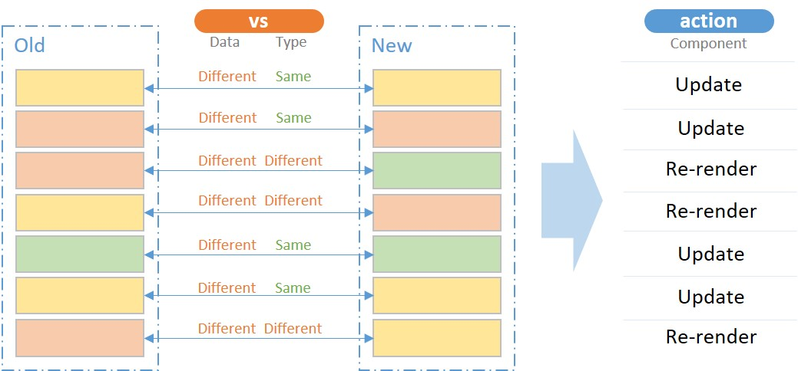

所谓逐 Card 更新（Delta Update），即会按顺序先比较新旧同一位置的 Card 是否类型是相同的：若相同则只更新数据和局部细节；否则，删除并重新渲染；如果更新后的 Card 数量比之前的更多，则多出来的会在前面的 Card 更新完后，再进行增加；如果更新后的 Card 数量更少，则会在更新完所有 Card 后，删除旧有多余的。

之所以按顺序比较，而不是先匹配好所有相似的，在以最大化替换的方式进行，这是因为如下原因。

- 按顺序可以确保界面在刷新过程中，是至上而下的，对于用户而言，屏幕呈现的往往是最上面的几个 Card，因此这些 Card 会被优先刷新，随后立即更新下面的各 Card，即便用户滑动页面，看到的效果也依旧为至上而下的流畅体验。
- 先行比较，同时也意味着要进行位移考虑，这所有的控制和执行，其本身也是需要耗费一定性能，而且还位于最一开始。如果按照顺序进行，便可直接进行渲染，而且先从用户所注视的区域进行。

因此，按顺序执行可以给用户感官上最佳体验。

### 泛 XCard 页面

实际上，XCard 技术并未止步于此，在其余各种类型的页面，均有用到该项技术。以下是一些示例。

- 搜索结果页
- 明星详情页
- 各类剧集详情页

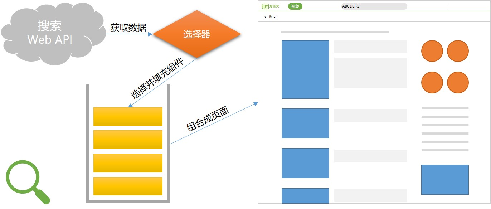

由于我们在搜索结果页中，支持了多种搜索结果项类型（如综艺类、短视频类、事件类、明星信息类），以及不同形式的意图识别模式（如系列电影、关系图谱、指定演员所演过的电视剧集合、某剧演员表等），为了适应这些不同种类的展现和交互形态的项，我们也采用了类似 XCard 的模式，将他们定义成一个个 Card，当通过搜索接口获取到结果后，将其解析成一组 Card，根据类型和配置，进行组合呈现。

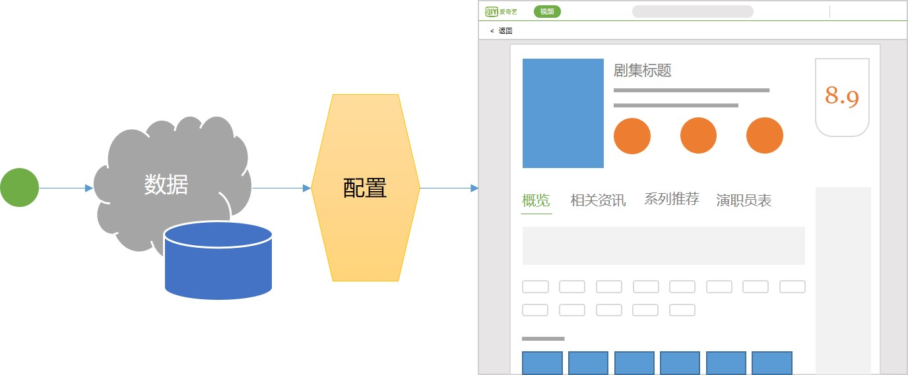

同样的模式也适用于电影详情页、电视剧详情页、综艺详情页等，以及明星详情页，但有所不同的是，这一类页面并不是一组 Card 排列呈现的，而是拥有一定的布局规则。例如，他们通常有一个头部信息，用于呈现最核心的内容，如名称和海报等，随后为一组 Tab，用于分类呈现详细信息，例如明星会有出演过的影视剧、主持或参与的综艺、花边新闻、资料等，各类剧集会有选集、简介、系列推荐、预告片和相关资讯、演职员表等，除此之外，通常还会有一列右侧边栏，用于推荐其他相关明星或视频资源。

对此，其实头部、右侧边栏各区块、Tab 内的各通栏，实际都被是为 Card。不同类型的剧集详情页，以及明星详情页，实际都是采用同一套逻辑实现的，但他们拥有不同的配置，当数据从缓存或线上获取到之后，根据类型套用不同的配置，随后采用 XCard 的加载和渲染方式进行组织呈现。

除此之外，还有许多页面都是以此方式进行实现的。

### Tile

除了不同页面等横向模块采用了 XCard 技术，纵向上也是如此，例如往下，其实许多通用组件也都是基于这种定制化的方式去实现的，从而实现最大化利用率和最富有扩展空间的适应能力。

Tile 是一个在 XCard 页面中应用最广泛的组件，它主要用于呈现一个视频资源的入口，其由小海报图、标题、描述等构成。然而，实际上，其呈现形态具有非常丰富的多样性。

根据配置的不同，可以设定其是否显示评分、一句话描述、悬浮播放按钮、弹幕等，以及海报图尺寸、标题行数、角标类型等，也可以定制许多区块中的内容，例如可以将标题下面设置为特定形式的内容，也可以在海报图上悬浮特定的元素等等。

不光如此，基于由多个 Tile 根据特定规则排列而成的 Tile 组合列表，也是同样支持多种模式配置的。

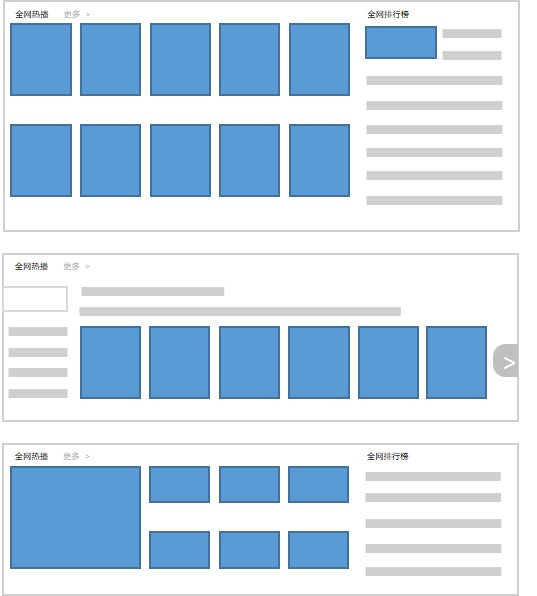

其具体的呈现、排列、分页形式，均可通过配置和编程来灵活控制。

实际上，XCard 中的部分模板，以及部分模板中的组件里，即是通过配置和编程 Tile 组合列表外加业务封装的形式来实现的。其它类型页面和组件中，也有 Tile 组合列表的身影。

由此可见，这种模式可以极大地提高组件的复用性，因为在许多场景下，即便是增加新的上层类型，实际上很多时候也只是使用现有的组件，通过配置来支持。而如果新的上层需求无法用现有组件实现，通过实现新的通用基础组件，也为未来该组件被其它场景采用提供了可能。

### XPage

同样的，页面层级往上，即路由也页面调度层级，实际也是采用 XCard 技术去实现的。

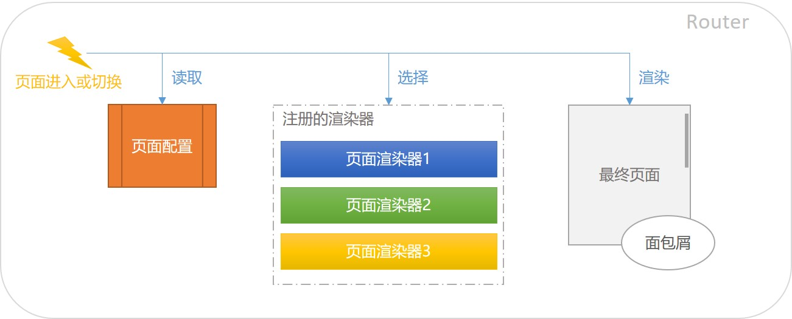

当 Web Native 页面被加载后，或者收到通知需要切换页面时，会由路由根据页面信息，来获取对应的页面配置，并由此判断该调用哪个页面渲染器，如 XCard 页面渲染器、详情页渲染器、搜索结果页渲染器、片库页渲染器，来加载配置并进行渲染。

另外，页面的进入和切换，以及其内部的逻辑，会由一个面包屑管理器来统一记录页面当下最新状态，以方便在触发后退操作的时候，根据需要，还原成离开时的样子。整体控制更为灵活。

## 收益

综上所述，其实通过 Web Native 化和引入 XCard 技术，能够在多种层面上，分别对产品本身和研发团队上带来收益。

### 快4

简单说来，就是各方各面都变快了。

- 开发快：与 Web 开发类似；且基于 XCard 技术所积累的模块，可以大幅提升后期开发效率。
- 部署快：下载和解压后即可使用。
- 运行快：与 Native 运行接近；且通过 XCard 技术加持，使得性能更强。
- 运营快：与内容及版式解耦。

这些快，实际上并非简单相加或相乘，而是可以达到指数增长，即“快4”（快的4次方）。经过努力，以下是我们的部分结果事实。

- 从原先的每2个月发布一个覆盖全网的新版本，加速为每2到3周为一个迭代周期；
- 每次全网覆盖升级过程，从1个月降低至2天以内；
- 用不到10人规模的团队和1年的时间，重新打造了一个花费数年完成的软件部分；
- 软件中大部分页面/窗口的运营更新，绝大多数时候不再需要研发团队参与，而且还能比以往更为灵活和高效的进行控制；
- 软件发布前内测 Bug 率也降低至历史最低，稳定性也超过从前。
- 运行和响应的感官速度大幅提升，以游戏频道推荐页为例，据测试，加载速度提升4-7倍。

### 技术驱动

技术驱动是研发团队的终极武器，它引领这团队与个人迈向更为长远和成功的方向。

通过以上内容，使得研发工程师更关注于技术本身，从而回归本职工作，并通过技术手段来驱动业务的发展前进。

## 结束语

碰撞带来更多火花，良好的架构可释放未来：通过汲取各方优点，并时刻注重高度抽象，以尽可能配置化的方式来代替简单业务实现，从而最终释放研发在业务层的工作，由此可以花费更多精力用于技术研究和开发上，并尝试突破自我。这整个过程，能给公司带来更灵活、更全面、更智能的业务和技术支撑。

最终，爱奇艺 PC 客户端软件，通过创新客户端开发架构，实现了再次华丽蜕变。并且，我们还将和大家一起继续前行。

.

2018年12月 北京

[PPT](./attachments/Top100Summit-2018-iQIYI-Arch.pptx)
