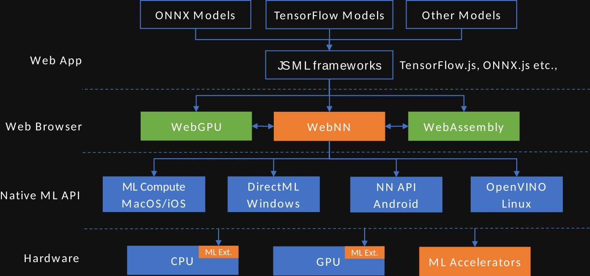
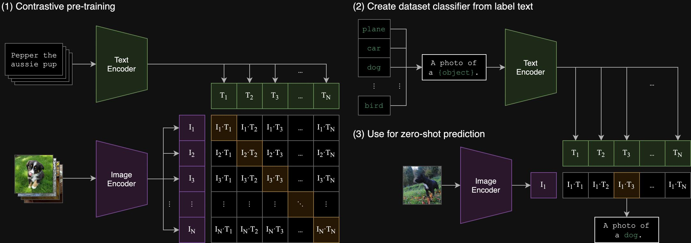
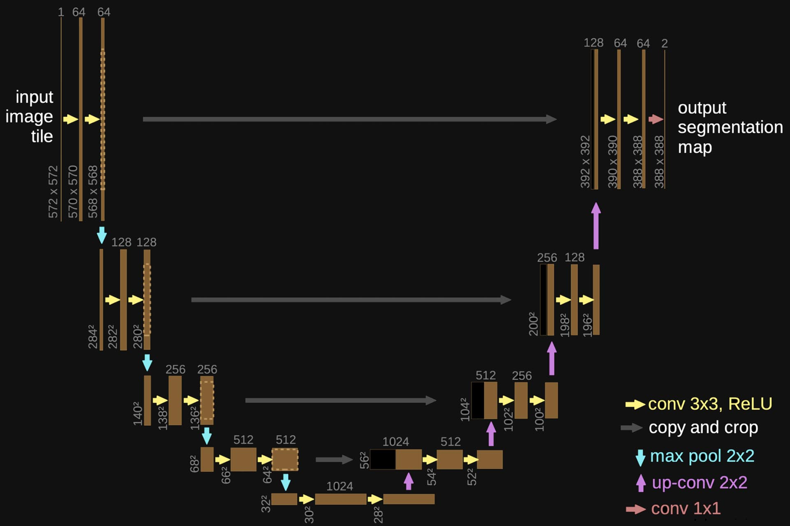
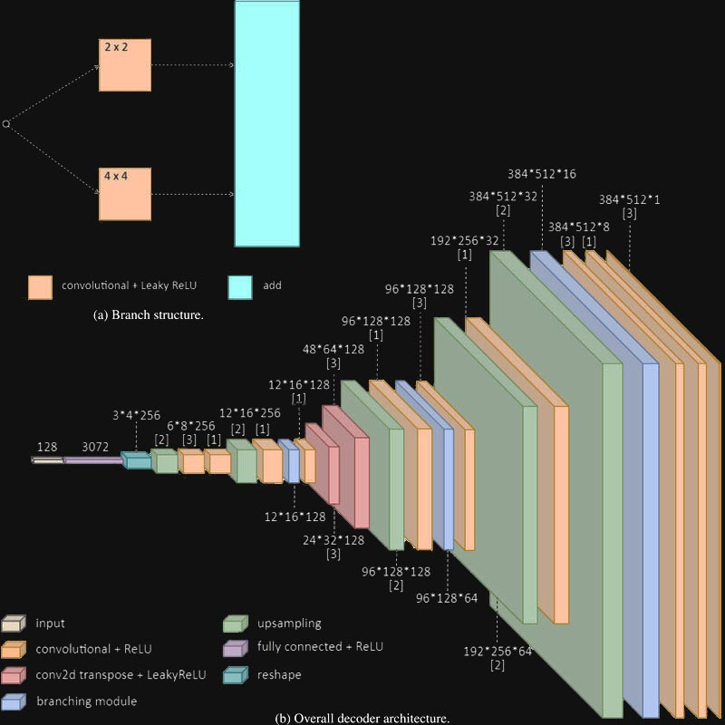
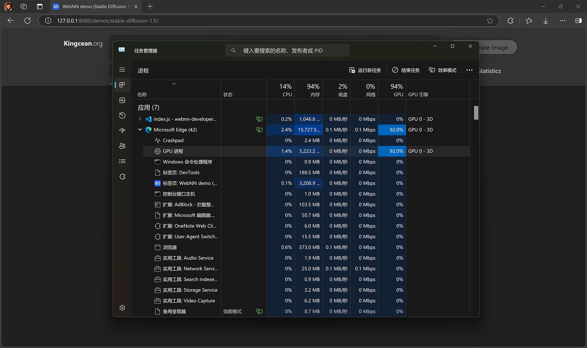
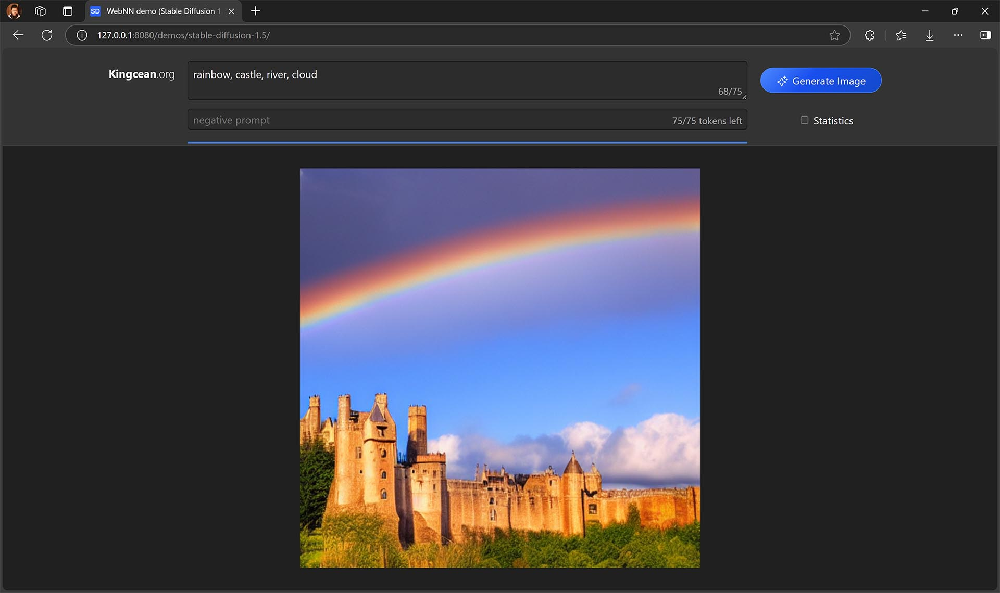
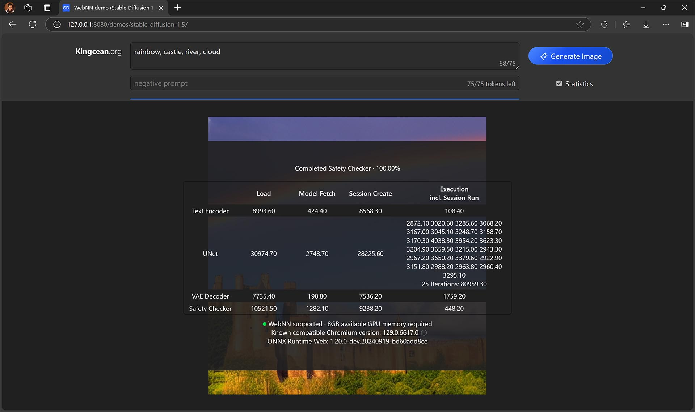

# WebNN —— Browser runs native AI

Web Neural Network API is a web-friendly W3C standard that provides a cross-platform abstraction layer independent of the operating system and underlying hardware based on browser-built JS APIs, leveraging GPUs, CPUs, NPUs, or other purpose-built AI accelerators to facilitate front-end R&D to build AI-based web applications.

## Overview

> https://www.w3.org/TR/webnn/

### Use

WebNN provides a standardized set of APIs for JS, allowing web front-end developers to create, compile, and run neural networks directly in the user's browser, or directly load and run existing AI models to implement various AI capabilities.

- Person detection
- Face detection
- Semantic segmentation
- Skeleton detection
- Style transfer
- Super resolution
- MEMC
- Image captioning
- Machine translation
- Noise suppression

As long as the model is the right size, all types of AI models can run on WebNN or perform specific functions directly in the browser.

### How it works

WebNN can run on the local device where the web frontend resides. For different operating systems used by clients, they run on different AI frameworks and have good integration capabilities with ONNX.



Specifically, WebNN serves as the intermediate unified adaptation layer, providing consistent access interfaces to the upper layer, calling the corresponding native API interfaces downwards based on different operating system routes, and then calling the CPU, GPU, or NPU of the hardware layer to perform specific calculations through these system-level frameworks, so as to provide performance similar to native machine learning in the browser.

| OS | Native ML Framework | Manuafactory |
| ------------ | ------------ | ---------- |
| Windows | [DirectML](https://learn.microsoft.com/en-us/windows/ai/directml/dml) | Microsoft |
| macOS / iOS / iPadOS | [CoreML](https://developer.apple.com/documentation/CoreML) | Apple |
| Android | [NN API](https://developer.android.google.cn/ndk/guides/neuralnetworks?hl=en-us) | Google |
| Linux (on Intel® Core) | [OpenVINO](https://www.intel.cn/content/www/us/en/developer/tools/openvino-toolkit/overview.html) | Intel |

In addition, on early, non-Windows devices, WebNN API polyfills built via the WebGL graphics API implement correspondence in a compatible way. Many newer Chromium-based browsers, such as Microsoft Edge, now support it. Since WebNN is actually driven by Microsoft and developed first on Edge on Windows, it currently (November 2024) has a better experience with this operating system and browser pairing.

On top of WebNN, the access to corresponding capabilities provided by browser-standardized JS APIs makes it easy to use some mainstream AI frameworks to run specific business logic. For example, you can use [ONNX runtime web](https://onnxruntime.ai/docs/tutorials/web/) and load the corresponding model to complete subsequent inference.

ONNX (Open Neural Network Exchange) is an AI framework and standard descriptive computational graph format, which contains many APIs from the top to the bottom layer, and can also be used as an intermediate layer to convert and call between PyTorch and TensorFlow, and supports on-premises, internal network, cloud, and hybrid modes, so that the local and cloud models can be run in a hybrid manner according to the program to meet diverse effects.

### Advantage

- __Performance optimization__

  By leveraging DirectML and corresponding other frameworks, WebNN enables web applications and frameworks to take advantage of the best available hardware and software optimizations for each platform and device without the complexity of platform-specific code.

- __Low latency__

  In-browser inference enables local media sources such as real-time video analytics, face detection, and speech recognition to use new use cases without sending data to a remote server and waiting for a response.

- __Privacy protection__

User data remains on the device and protects user privacy, as web apps and frameworks do not need to upload sensitive or personal information to cloud services for processing.

- __高可用性__

  Offline, there is no dependency on the network after the initial asset cache, because web applications and frameworks can run neural network models locally even if an internet connection is unavailable or unreliable.

- __低服务器成本__

  Computing on client devices means no servers are required, which helps web applications reduce the cost of operating and maintaining AI/ML services in the cloud.

Compared with terminal AI (or hybrid AI) developed directly in a native way, WebNN can achieve faster program logic update and iteration, and obtain more significant cross-platform development advantages, that is, there is no need to develop for each platform separately, and the browser and its built-in WebNN underlying adaptation layer can smooth out the differences between different platforms, and finally only need to develop and deploy a piece of code without distinction.

For online (cloud) AI, it has obvious advantages in privacy protection and low latency, and can also reduce server costs and control bandwidth costs by setting JS programs and model caching policies. In addition, for AI programs that are Web-based clients or B/S architectures, the front-end interface interaction part itself can be reused, and the ability migration can be quickly completed by simply replacing the implementation of AI capability calls in the browser backend.

Before this technology, if you want to add AI capabilities to the web frontend, in addition to based on online (cloud) AI, in fact, another way is to introduce wasm, but wasm is heavier to develop, and the interaction with JS is relatively not so close and friendly, and because it is based on native capabilities, there are still cross-platform problems. These are all aspects of its inferiority to WebNN.

| Item | | Client AI | Online AI | Wasm | WebNN |
| ---------- | :--: | :----: | :----: | :----: | :----: |
| Executing inference position | - | Local | Cloud | Local | Local |
| Performance | ☆ | High | High | Low | High |
| Latency | ☆ | Low | High | Low | Low |
| Cross-platform | ☆ | No | Yes | No | Yes |
| Update and distribution | ☆ | Hard | Easy | Easy | Easy |
| Server costs | | Low | High | Low | Low |
| Privacy risks | | None | Exist | None | None |
| Weak network availability | | Yes | No | Yes | Yes |
| R&D complexity | | Per platform | Low | High | Low |

## Implementation

WebNN is ultimately a collection of JS APIs built into the browser, which is provided by exposing classes and functions, and is not technically different from other browser built-in JS APIs in terms of call methods and bridge implementations.

### Common types

- `MLGraph`：编译后的计算图，将源、路由、模型、转换器和接收器等节点有机串联起来。
- `MLOperand`：计算图运行中将多个操作进行整合的操作过程。
- `MLTensor`：张量，一种数据容器，用于作为模型输入参数和输出结果。
- `MLContext`：所有 AI 操作的通用上下文，可以基于此创建组件，用于数据准备、特征工程、训练、预测和模型评估，以及追踪等附加功能。
- `MLGraphBuilder`：简单说来，可以被认为是 `MLGraph` 和 `MLOperand` 的工厂。

具体创建和执行链路：`MLContext` 包含设备搭载的可用芯片（CPU、GPU、NPU 等）和电源平衡状态（高性能或低功耗）等信息，以此为参数创建 `MLGraphBuilder`，用于构建计算图（Computational Graph），再编译成 `MLGraph`，便可传入输入 Buffers 并产生输出 Buffers。

### ONNX

[Open Neural Network Exchange](https://onnx.ai/) 支持市面上大多数主流 AI 框架，功能强大，简化并统一了许多调用方式，其封装格式也更为通用，是现代许多 AI 开发的利器。

ONNX runtime web 是 ONNX 的 JS 前端版，已为 WebNN 做了充分适配，因此只需引入该前端框架，并基于此进行开发即可。

```bash
npm i onnxruntime-web
```

> https://onnxruntime.ai/docs/api/js/index.html

另，ONNX 还有适用于以下场景的 JS 版本。

| 其它适用场景 | npm |
| ---------- | ---------- |
| Node.js 服务器后端（或中间层） | [onnxruntime-node](https://www.npmjs.com/package/onnxruntime-node) |
| React Native | [onnxruntime-react-native](https://www.npmjs.com/package/onnxruntime-react-native) |

### Capability enabled

对于 Edge 和 Chrome 浏览器，建议更新至 v130.0 或更高版本，并确保启用以下特性。

```url
about://flags/#web-machine-learning-neural-network
```

> Enables the Web Machine Learning Neural Network (WebNN) API. → __Enabled__

## Text 2 Image

Let's use Stable Diffusion 1.5 as an example to demonstrate how to use it.

> Microsoft provides an example of Image Classification (identifying items in images), which is relatively simple and uses the [MobileNet v2](https://huggingface.co/docs/transformers/model_doc/mobilenet_v2) model, which can be learned from the link below.
>
> https://learn.microsoft.com/en-us/windows/ai/directml/webnn-tutorial
>
> This article uses a relatively more complex but common scenario to show, based on [high-resolution image synthesis with latent diffusion models](https://github.com/Stability-AI/StableDiffusion) (powered by Stability AI), which uses multiple models and has some complex data processing.

### Download models

Normally, the following four models are used to generate images from text using Stable Diffusion. Since the AI framework used in this example is the ONNX runtime web mentioned above to simplify the use and enhance cross-platform capabilities, the corresponding ONNX model encapsulation format (.onnx) file can be used directly.

> The following are all from the Microsoft repository on Hugging Face.

#### 1. Text split embedding

| Key | Value |
| ------ | -------------------- |
| Name | __text-encoder__ |
| Size | 235 MB |

🔗 https://huggingface.co/microsoft/stable-diffusion-v1.5-webnn/resolve/main/text-encoder.onnx

By converting human-readable text into a CLIP model that AI models can understand, it realizes the description of image-drawn information.



#### 2. Multi-level feature extraction and image segmentation

| Key | Value |
| ------ | -------------------- |
| Name | __unet__ |
| Size | 1.60 GB |

🔗 https://huggingface.co/microsoft/stable-diffusion-v1.5-webnn/resolve/main/sd-unet-v1.5-model-b2c4h64w64s77-float16-compute-and-inputs-layernorm.onnx

This is a convolutional network for biomedical image segmentation model composed of multiple layers of ResNet modules connected in series, and a cross-attention mechanism is added between them to receive additional text instructions to guide image generation. In this example, we expect to perform 25 rounds to convert random noise into image hidden features.



#### 3. Variational autoencoders

| Key | Value |
| ------ | -------------------- |
| Name | __vae-decoder__ |
| Size | 95 MB |

🔗 https://huggingface.co/microsoft/stable-diffusion-v1.5-webnn/resolve/main/Stable-Diffusion-v1.5-vae-decoder-float16-fp32-instancenorm.onnx

The decoding part is used here, which can pull up the picture with high quality within a certain range, that is, after upgrading from low resolution to high resolution, it can ensure that the details of the regular scene are still delicate and complete as much as possible, in line with certain natural laws.



#### 4. Safety check

| Key | Value |
| ------ | -------------------- |
| Name | __safety-checker__ |
| Size | 580 MB |

🔗 https://huggingface.co/microsoft/stable-diffusion-v1.5-webnn/resolve/main/safety_checker_int32_reduceSum.onnx

In fact, it is a security audit that filters out some content that should not appear. The image is already generated when this process is performed, so it is a deferred process.

### Dependencies

#### ONNX runtime web

You can embed code into your code via npm and packaging tools, or you can upload scripts directly to Byte's CDN and be referenced by the page.

> [npm package](https://www.npmjs.com/package/onnxruntime-web) (onnxruntime-web)

```html
<script type="text/javascript" src="https://cdn.jsdelivr.net/npm/onnxruntime-web@1.18.0-dev.20240311-5479124834/dist/ort.webgpu.min.js" />
```

`ort` in following codes the root instance of ONNX runtime web.

### Codes

#### 1. Detection

The key to determining whether the property `ml` on the `navigator` to identify browser can call the method `createContext` that allows an optional configuration parameter to be passed in and returns a `Promise` object with its `fulfilled` value of type `MLContext` that can be used as a parameter to create a `MLGraphBuilder` instance for graph compilation and execution, but here we are just borrowing this capability to verify that WebNN is available.

```javascript
async function builder() => {
    const context = await navigator.ml.createContext();
    if (!context) throw new Error();
    const builder = new MLGraphBuilder(context);
    if (builder) return builder;
    throw new Error();
};
```

If the above code is not supported, it will throw an `Error`, which can be `catch`ed for exception handler later.

#### 2. Load models

1. We implement a model loading function, pass in the model name and initialization parameters, download the online model file to the stored value OPFS (Source Private File System) via fetch (see the _Helper and config_ section attached later for the specific details of function `getModelOPFS`), and create an inference session to return it accordingly.

   The name is used to create an index to find files in OPFS, so it can be an arbitrary string identifier; The parameters are filled in according to the requirements of different models, and will be passed in in step 3.3.

```javascript
/**
 * Load the specific model.
 */
async function loadModel(name, dimension) {
    let path = "model/" + modelMapping[name];
    const options = {
        executionProviders: [{
            name: executionProvider,
            deviceType: "gpu",
        }],
        freeDimensionOverrides: dimension,
        logSeverityLevel: 0
    };
    let modelBuffer = await getModelOPFS("sd_1.5_$" + name, path, false);
    return await ort.InferenceSession.create(modelBuffer, options);
}
```

2. We will stage the above 4 models.

```javascript
// All models are following.
let textEncoderSession;
let vaeDecoderModelSession;
let unetModelSession;
let scModelSession;
```

3. Next, we need to initialize the above-mentioned function to load the model and create a corresponding inference session, which is stored in the above staging variable. Of course, to prevent accidents, we also clean up before initializing it, i.e. if the inference session already exists, then we release it. The initialization parameters of each model are passed in according to their requirements, and some of the fields are fixed values here (see the _Helper and config_ section attached later for details of the configuration code).

```javascript
/**
 * Load all models.
 */
async function init() {
    cleanUpModels();
    textEncoderSession = await loadModel("text-encoder", {
        batch: unetBatch, sequence: textEmbeddingSequenceLength,
    });
    unetModelSession = await loadModel("unet", {
        batch: unetBatch, channels: unetChannelCount, height: latentHeight, width: latentWidth, sequence: textEmbeddingSequenceLength, unet_sample_batch: unetBatch, unet_sample_channels: unetChannelCount, unet_sample_height: latentHeight, unet_sample_width: latentWidth, unet_time_batch: unetBatch, unet_hidden_batch: unetBatch, unet_hidden_sequence: textEmbeddingSequenceLength
    });
    vaeDecoderModelSession = await loadModel("vae-decoder", {
        batch: 1, channels: latentChannelCount, height: latentHeight, width: latentWidth,
    });
    scModelSession = await loadModel("safety-checker", {
        batch: 1, channels: 3, height: 224, width: 224,
    });
}

/**
 * Clean up models.
 */
async function cleanUpModels() {
    if (!textEncoderSession) return;
    await unetModelSession.release();
    await textEncoderSession.release();
    await vaeDecoderModelSession.release();
    await scModelSession.release();
    unetModelSession = null;
    textEncoderSession = null;
    vaeDecoderModelSession = null;
    scModelSession = null;
}
```

#### 3. Execute inference

In fact, the key to running the model is to construct the parameters required during the model run, some of the values come from the context (such as the return value of the previous model), so most of the code here is doing such conversions, many fields of these parameters are type of `MLTensor`, so it is often necessary to convert some arrays and other objects to this type type (the implementation of the conversion method can be seen in the _Helper and config_ section below). After the parameters required for the running process are prepared, the call to the model itself is actually very simple, just call the member method `run` on the above-mentioned staging inference session instance, and its parameters are the parameters required for the above processed execution process.

Overall, the inference session is executed in the order of text encoding, unet loop execution, VAE decoding, and health review, where a potential space is created to store its results before the unet is executed, and images can be generated after VAE decoding is complete.

```javascript
async function run(positiveText, negativeText) {
    /* ------- Text encoder ------- */
    const textEncoderInputs = textEncoderInputsGen(positiveText, negativeText);
    const textEncoderOutputs = await textEncoderSession.run(textEncoderInputs);

    /* ------- Generate latent spaces ------- */
    const latentsTensor = toTensor(
        "float16",
        [unetBatch, unetChannelCount, latentHeight, latentWidth],
        latentSpace,
    );
    const halfLatentElementCount = latentsTensor.size / 2; // Only resolve the first batch [2, 4, 64, 64].
    let latents = await latentsTensor.getData();
    let halfLatents = latents.subarray(0, halfLatentElementCount); // Get the first batch。

    /* ------- U-Net in loop ------- */
    const unetInputs = await unetInputsGen(textEncoderOutputs);
    for (var i = 0; i < unetIterationCount; ++i) {
        unetInputsRound(unetInputs, i);
        const unetOutputs = await unetModelSession.run(unetInputs);
        let predictedNoise = new Uint16Array(unetOutputs["out_sample"].cpuData.buffer);
        denoiseLatentSpace(/*inout*/ latents, i, predictedNoise);
    }

    /* ------- VAE decode ------- */
    const vaeDecoderInputs = vaeDecoderInputs(latentsTensor, halfLatents);
    const decodedOutputs = await vaeDecoderModelSession.run(vaeDecoderInputs);

    /* ------- Render in canvas ------- */
    displayPlanarRGB(await decodedOutputs.sample.getData());
    
    /* ------- Safety check ------- */
    let resized_image_data = resize_image(224, 224);
    let normalized_image_data = normalizeImageData(resized_image_data);
    const { has_nsfw_concepts } = await scModelSession.run({
        clip_input: get_tensor_from_image(normalized_image_data, "NCHW"),
        images: get_tensor_from_image(resized_image_data, "NHWC"),
    });
    let nsfw = has_nsfw_concepts.data[0]; // flag about not safe for work
}
```

In the above code, the render function `displayPlanarRGB` (the specific implementation is omitted here) accepts the coordinate color information and draws it onto the canvas.

The specific parameters are as follows.

1. __Text encoding parameters__: Where `positiveText` is the forward text description, that is, what image the user wants to generate; `negativeText` is negative, that is, which situations are excluded.

```javascript
async function textEncoderInputsGen(positiveText, negativeText) {
    let positive_token_ids = [49406];
    let negative_token_ids = [49406];
    const positive_text_ids = await getTokenizers(positiveText);
    positive_token_ids = positive_token_ids.concat(positive_text_ids);
    if (positive_text_ids.length > textEmbeddingSequenceLength - 2) {
        positive_token_ids = positive_token_ids.slice(0, textEmbeddingSequenceLength - 1);
        positive_token_ids.push(49407);
    } else {
        const fillerArray = new Array(textEmbeddingSequenceLength - positive_token_ids.length).fill(49407);
        positive_token_ids = positive_token_ids.concat(fillerArray);
    }

    let negative_text_ids = await getTokenizers(negativeText);
    negative_token_ids = negative_token_ids.concat(negative_text_ids);
    if (negative_text_ids.length > textEmbeddingSequenceLength - 2) {
        negative_token_ids = negative_token_ids.slice(0, textEmbeddingSequenceLength - 1);
        negative_token_ids.push(49407);
    } else {
        const fillerArray = new Array(textEmbeddingSequenceLength - negative_token_ids.length).fill(49407);
        negative_token_ids = negative_token_ids.concat(fillerArray);
    }

    const token_ids = positive_token_ids.concat(negative_token_ids);
    return {
        input_ids: toTensor("int32", [unetBatch, textEmbeddingSequenceLength], token_ids),
    };
}
```

2. __U-Net parameters__：Contains the generation of input baselines, as well as changes during subsequent cycles. (The _Helper and config_ section is attached later)

```javascript
async function unetInputsGen(textEncoderOutputs, halfLatents) {
    let latentSpace = new Uint16Array(latentWidth * latentHeight * unetChannelCount);
    generateNoise(/*inout*/ latentSpace, seed);
    latentSpace = new Uint16Array([...latentSpace, ...latentSpace]); // Repeat based on unetBatch.
    prescaleLatentSpace(/*inout*/ halfLatents, defaultSigmas[0]);
    return {
        encoder_hidden_states: toTensor(
            "float16",
            [unetBatch, textEmbeddingSequenceLength, textEmbeddingSequenceWidth],
            textEncoderOutputs["last_hidden_state"].data,
        ),
    };
}

function unetInputsRound(unetInputs, i) {
    unetInputs["timestep"] = fillTensor("int64", [unetBatch], BigInt(Math.round(defaultTimeSteps[i])));
    let nextLatents = latents.slice(0); // Copy the first batch used to positive prompt or negative one.
    let halfNextLatents = nextLatents.subarray(0, halfLatentElementCount);
    scaleLatentSpaceForPrediction(/*inout*/ halfNextLatents, i);
    nextLatents.copyWithin(halfLatentElementCount, 0, halfLatentElementCount); // Copy from low to high.
    unetInputs.sample = toTensor(
        "float16",
        [unetBatch, unetChannelCount, latentHeight, latentWidth],
        nextLatents,
    );
}
```

3. __VAE decoding parameters__：Since the previous step unet basically stores the results in latent space, there is no need to use its corresponding Outputs for entering parameters here.

```javascript
function async vaeDecoderInputsGen(latentsTensor, halfLatents) {
    applyVaeScalingFactor(/*inout*/ halfLatents); // Decode from latent.
    let dimensions = latentsTensor.dims.slice(0);
    dimensions[0] = 1; // Set the size of batch as 1.
    const vaeDecoderInputs = {
        latent_sample: toTensor("float16", dimensions, halfLatents.slice(0)),
    };
}
```

4. __Safety check arguments__：Relatively short, already in the function `run`. (The implementation of functions such as changing the image size involved is omitted here)

#### Helper and config

- __Configuration__

```javascript
const pixelWidth = 512;
const pixelHeight = 512;
const latentWidth = pixelWidth / 8;
const latentHeight = pixelHeight / 8;
const latentChannelCount = 4;
const unetBatch = 2;
const unetChannelCount = 4;
const textEmbeddingSequenceLength = 77;
const textEmbeddingSequenceWidth = 768;
const unetIterationCount = 25;
const executionProvider = "webnn";
const ArrayTypeMapping = {
    uint8: Uint8Array,
    int8: Int8Array,
    uint16: Uint16Array,
    int16: Int16Array,
    uint32: Uint32Array,
    int32: Int32Array,
    float16: Uint16Array,
    float32: Float32Array,
    uint64: BigUint64Array,
    int64: BigInt64Array
}
const modelMapping = { // Mapping of model path
    "text-encoder": "text-encoder.onnx",
    "unet": "sd-unet-v1.5-model-b2c4h64w64s77-float16-compute-and-inputs-layernorm.onnx",
    "vae-decoder": "Stable-Diffusion-v1.5-vae-decoder-float16-fp32-instancenorm.onnx",
    "safety-checker": "safety_checker_int32_reduceSum.onnx"
};
let seed = "1234"; // Random seed, can be modified.
```

- __Model → OPFS__

```javascript
/**
 * Get model from Origin Private File System.
 */
async function getModelOPFS(name, url, updateModel) {
    const root = await navigator.storage.getDirectory();
    let fileHandle;

    async function updateFile() { // 更新
        const response = await fetch(url);
        const contentLength = response.headers.get("Content-Length");
        let total = parseInt(contentLength ?? "0");
        let buffer = new Uint8Array(total);
        let loaded = 0;
        const reader = response.body.getReader();
        
        async function read() { // 读取 fetch 的 response 的 buffer
            const { done, value } = await reader.read();
            if (done) return;
            let newLoaded = loaded + value.length;
            fetchProgress = (newLoaded / contentLength) * 100;
            if (newLoaded > total) {
                total = newLoaded;
                let newBuffer = new Uint8Array(total);
                newBuffer.set(buffer);
                buffer = newBuffer;
            }
            
            buffer.set(value, loaded);
            loaded = newLoaded;
            return read();
        }
    
        await read();
        fileHandle = await root.getFileHandle(name, { create: true });
        const writable = await fileHandle.createWritable();
        await writable.write(buffer);
        await writable.close();
        return buffer;
    }

    if (updateModel) return await updateFile();
    try {
        fileHandle = await root.getFileHandle(name);
        const blob = await fileHandle.getFile();
        return await blob.arrayBuffer();
    } catch (ex) {
        return await updateFile();
    }
}
```

- __Convert to `MLTensor`__

```javascript
/**
 * Convert a value or byte to tensor.
 */
export function toTensor(dataType, shape, values) {
    let size = 1;
    shape.forEach(element => {
        size *= element;
    });
    if (!(values instanceof ArrayBuffer) && values.buffer instanceof ArrayBuffer) values = values.buffer;
    const type = ArrayTypeMapping[dataType];
    if (!type) throw new Error(`Input tensor type ${dataType} is unknown`);
    return new ort.Tensor(dataType, new type(values), shape);
}

/**
 * Create and fill tensor.
 */
export function fillTensor(dataType, shape, values) {
    let size = 1;
    shape.forEach(element => {
        size *= element;
    });
    if (!(values instanceof ArrayBuffer) && values.buffer instanceof ArrayBuffer) values = values.buffer;
    const type = ArrayTypeMapping[dataType];
    if (!type) throw new Error(`Input tensor type ${dataType} is unknown`);
    return new ort.Tensor(
        dataType,
        type.from({ length: size }, () => value),
        shape,
    );
}
```

- __Latent space correlation__

```javascript
function generateNoise(latentSpace, seed) {
    let randomGenerator = practRandSimpleFastCounter32(
        Number(seed >> 0n) & 0xffffffff,
        Number(seed >> 32n) & 0xffffffff,
        Number(seed >> 64n) & 0xffffffff,
        Number(seed >> 96n) & 0xffffffff,
    );
    const elementCount = latentSpace.length;
    for (let i = 0; i < elementCount; ++i) {
        const u1 = randomGenerator();
        const u2 = randomGenerator();
        const radius = Math.sqrt(-2.0 * Math.log(u1));
        const theta = 2.0 * Math.PI * u2;
        const standardNormalRand = radius * Math.cos(theta);
        const newValue = standardNormalRand;
        latentSpace[i] = encodeFloat16(newValue);
    }
}

function prescaleLatentSpace(latentSpace, initialSigma) {
    const elementCount = latentSpace.length;
    for (let i = 0; i < elementCount; ++i) {
        latentSpace[i] = encodeFloat16(Utils.decodeFloat16(latentSpace[i]) * initialSigma);
    }
}

function scaleLatentSpaceForPrediction(latentSpace, iterationIndex) {
    let sigma = defaultSigmas[iterationIndex];
    let inverseScale = 1 / Math.sqrt(sigma * sigma + 1); // sample /= ((sigma^2 + 1) ^ 0.5)
    const elementCount = latentSpace.length;
    for (let i = 0; i < elementCount; ++i) {
        latentSpace[i] = encodeFloat16(Utils.decodeFloat16(latentSpace[i]) * inverseScale);
    }
}

function practRandSimpleFastCounter32(a, b, c, d) {
    return function () {
        a >>>= 0;
        b >>>= 0;
        c >>>= 0;
        d >>>= 0;
        var t = (a + b) | 0;
        a = b ^ (b >>> 9);
        b = (c + (c << 3)) | 0;
        c = (c << 21) | (c >>> 11);
        d = (d + 1) | 0;
        t = (t + d) | 0;
        c = (c + t) | 0;
        return (t >>> 0) / 4294967296;
    };
}
```

### Running effect

Thus, the general logic of the entire Wensheng diagram is completed. The following are partial running screenshots.



🔺 _At runtime, the browser's GPU-accelerated process consumes a lot of GPU resources, indicating that the model is running in the device-side browser. In addition, the tab takes up a huge amount of memory, indicating that the model is loaded locally._



🔺 _Generated images. The prompts used are: rainbow, castle, river, cloud._



🔺 _Metric information statistically stated during initialization and run._

__Notes__: The PC used to demo is following.

| Key | Value |
| -------- | -------------------- |
| OS | Windows 11 Pro version 23H2 |
| Browser | Microsoft Edge v131.0.2903.51 |
| CPU | Intel® Core™ i7-13700H |
| GPU | Intel® Iris® Xe Graphics (iGPU) |
| NPU | N/A |
| RAM | 32GB |

## Closing

WebNN is a newborn baby, but the powerful capabilities it contains have been demonstrated: when AI is expanding at an unprecedented rate, it can be fully introduced into web front-end development through more reliable performance and user-friendly access, allowing neural networks to be created, compiled, and run directly in the browser on the user's device, or directly load and run existing AI models, without being distracted by the underlying system framework implementation and the chip used, based on familiar JS development. Achieve cross-platform.

### Present and Outlook

Currently (November 2024), WebNN is still in the Candidate Recommendation Draft state, and the [Web Machine Learning Working Group](https://www.w3.org/groups/wg/webmachinelearning/), a group specially established by W3C, is advancing it, and there is still a little time before the final official version (Standard). At the time of experimentation, it is recommended to run the Edge browser on Windows 11 for the best experience.

However, it is foreseeable that given that the WebNN standard is almost formed, and that the capabilities it contains are indeed completely absent in the web front-end in the past, and this capability keeps pace with the times, conforms to the trend, and symbolizes the future development direction, we can think that WebNN can play an immeasurable role in the long run, and will even be as universal as many changes such as HTML5 in the past, that is, it will become an infrastructure, becoming an infrastructure for every web front-end, hybrid mobile, It is a must-have for models such as web-based PC clients such as Electron apps, as its changes can lead to more significant interactions, capabilities, and efficiency gains.

### For us

Affected by the limitations of the current network and computer hardware in the real environment, WebNN still has some unsuitable places. However, in the long run, it may be a significant direction in the next two or three years, because the impact of AI popularization on the industry, as well as the side AI, web cross-device capabilities, and some other advantages of WebNN make it more potential and valuable. Therefore, it is forward-looking to know in advance.

With WebNN, inference of some models and even a small amount of distributed training can be deployed to the client browser side, thereby achieving more intelligent capabilities, and the additional workload to complete this process is actually not significantly increased, because for mobile AI and online (cloud) AI, this part of the workload is also included, and the former considers cross-platform, and the latter considers data interaction, which may save more workload and have the advantages mentioned above.

<!-- End -->
---

Some of the pictures in this article are from the Internet, and the copyright belongs to their owners.
