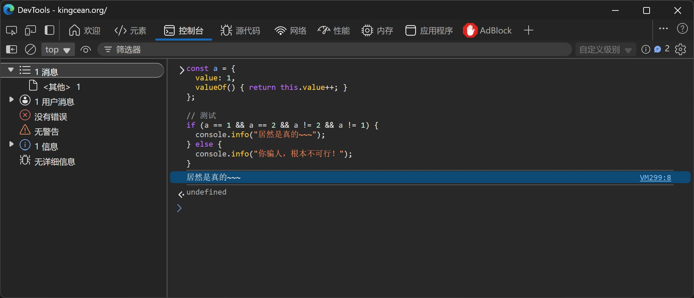

如果让我们创建一个对象 `a`，使得 `a == 1 && a == 2 && a != 2 && a != 1` 等式成立，这听起来很诡异，但仔细一想，其实还是很容易实现的。

## 实现

先不说那么多，直接上代码！

```javascript
const a = {
  value: 1,
  valueOf() {
    return this.value++;
  }
};

// 测试
if (a == 1 && a == 2 && a != 2 && a != 1) {
  console.info("居然是真的~~~");
} else {
  console.info("你骗人，根本不可行！");
}
```

好了，让我们打开浏览器 DevTools，切到 控制台 里把以上代码贴上去运行一下看看结果。



完美！输出的内容正是 `if (a == 1 && a == 2 && a != 2 && a != 1)` 为 `true` 的分支场景。

> 居然是真的~~~

### 弱类型

其实许多对 JavaScript 熟知的盆友们一眼就明白了，这个 `valueOf()` 是这个“诡异效果”的功臣。它是 `Object` 的原型方法，也就是说，所有对象都继承了这个成员方法。当然，我们可以按需重写这个方法，以返回更合适的内容。这个方法的作用在于返回对象的原始值，JavaScript 在诸如一元运算和等号运算等一些需要对象转换成基本类型值的场景，会在内部隐式地自动调用该函数。

众所周知，JavaScript 是一门弱类型语言，其有双等号（== 及对应不等于 !=）和三等号（=== 及对应不等于 !==）之分，其中前者支持弱类型的相等比较，这意味着我们可以经常使用与预期类型不同的类型的值，例如以下几个示例。

```javascript
console.log(1 == "1");   // -> true
console.log(true == 1);  // -> true
```

实际这个弱语言特性，还在其它一些场景中广泛存在，例如下面的加法。

```javascript
console.log(1 + "1");    // -> "11"
console.log(true + 1);   // -> 2
console.log(false + 1);  // -> 1
```

之所以 JavaScript 能够将这些不同类型的值，通过一些策略和规则，最终友好地得出一些不符合直观上强类型的结果，那是因为，在具体执行前，JavaScript 语言将其中一些值转换为更适合的类型了。例如，

- 上例第1行的 `1 + "1"`，其中 `1` 被转隐式成了字符串 `"1"`；
- 上例第2行的 `true + 1`，其中 `true` 被隐式转换成了数字 `1`。

### `Symbol.toPrimitive`

JavaScript 如何执行这类转化呢？首先，它会根据当前语句，包括已有变量类型，推断应该用什么类型更为合适，其会大致按照如下顺序依次调用对象中的方法（如果有且适用）。

1. `[Symbol.toPrimitive](hint)`：尝试获取转化为特定类型的值。默认情况下没有这个方法；如果有，则必须返回一个基本类型的值。其中，参数 `hint` 为字符串，会传入如下值。
   - '"default"'：通常都是此值，除了以下情况。
   - '"number"'：数字强制转换时，包括一元数字运算和 `Number()`。
   - '"string"'：字符串强制转换时，如模板字符串和 `String()`。
2. `valueOf()`：尝试获取该对象原本的内置值。默认返回自身。当返回值是非复杂类型时，会被忽略。
3. `toString()`：输出格式化后的字符串内容。仅部分场景适用。

让我们来再做几个试验。先定义一个对象，里面包含了上述各方法。

```javascript
const a = {
  valueOf() { return 1; },
  toString() { return "b"; },
  [Symbol.toPrimitive](hint) {
    if (hint === "number") return 2;
    if (hint === "string") return "c";
    if (hint === "default") return 3;
    return 4;
  }
};
```

然后可以看看在不同场合下，JavaScript 会进行何种处理。先看双等号的等于比较（`==`），可以看出，优先执行到了 `[Symbol.toPrimitive]("default")` 语句。

```javascript
console.log(a == 1);   // -> false
console.log(a == "b"); // -> false
console.log(a == 2);   // -> false
console.log(a == 3);   // -> true
console.log(a == 4);   // -> false
```

再看看数字和字符串强制转化时的各场景。

```javascript
// [Symbol.toPrimitive]("number")
console.log(Number(a)); // -> 3
console.log(+a); // -> 3
console.log(-a); // -> -3

// [Symbol.toPrimitive]("string")
console.log(String(a)); // -> "c"
console.log(`${a}`); // -> "c"

// .toString()
console.log(a.toString()); // -> "b"
```

对于其它需要转化为简单类型的场景，也都执行到了 `[Symbol.toPrimitive]("default")` 语句。

```javascript
console.log(a + 7);   // -> 10
console.log(a + "!"); // -> "3!"
```

由此可见，`[Symbol.toPrimitive](hint)` 拥有非常高的优先级，且其在不同场景下传入的参数会根据实际情况而不同。而当它不存在时，则 `valueOf()` 便成为对应的方法了。

### `valueOf`

如前面所述，`valueOf()` 是各类型都有的方法，除了 `null` 和 `undefined` 外，你在各对象中都能找到它。默认情况下，它返回的是对象自身（`this`），但也有一些类型重写了此方法，例如 `Date`，如下。

```javascript
const today = new Date("2025-10-17T00:00:00Z");
console.log(today.valueOf()); // -> 1760659200000
```

我们也可以在自己的对象或类实现中，重写此方法。

```javascript
const a = {
  valueOf() { return 1; }
};
```

然后我们再来做试验进行验证，情况如下。

```javascript
console.log(a == 1);    // -> true
console.log(a == true); // -> 1 == true -> true
console.log(a + 1);     // -> 2
console.log(a + "!");   // -> "1!"
console.log(Number(a)); // -> 1
console.log(String(a)); // -> "[object Object]"
console.log(`${a}`);    // -> "[object Object]"
```

这里要特别说明一下最后两行 `String(a)` 和字符串模板 `${a}`，其返回的是基于 `a.toString()` 的值，而不是 `String(a.valueOf())`，即便 `valueOf()` 实现里返回的是一个字符串，也依旧如此，即此处仍会是 `"[object Object]"`。但是，如果实现了 `toString()` 方法，那么将会是方法调用后返回的值，且无论 `valueOf()` 的实现为何皆如此。

```javascript
a.toString = function () { return "Hi!"; };

// 测试
console.log(String(a)); // -> "Hi!"
```

然后我们再来测试以下 `valueOf()` 返回的是复杂类型时的场景，会发现相当于效果如同并无此重写一样，即强制转化时，并为采纳该方法返回的结果，而仍旧当作普通对象进行处理。

```javascript
const b = {
  valueOf() { return a; }  
};

// 测试
console.log(b.valueOf().valueOf()); // -> 1
console.log(b == a); // -> false
console.log(b == 1); // -> false
console.log(b == b); // -> true
console.log(`${b}`); // -> "[object Object]"
```

### 另一种实现

所以，实现 `a == 1 && a == 2 && a != 2 && a != 1` 时，除了最前面采用 `valueOf()` 的示例外，还可以用 `[Symbol.toPrimitive](hint)` 实现，效果一致。

```javascript
const a = {
  num: 1,
  [Symbol.toPrimitive](hint) {
    return this.num++;
  }
};
```

当然，以上两种实现（基于 `valueOf()` 和基于 `[Symbol.toPrimitive](hint)`）都是存在副作用的，仅仅一些引用就导致其内置内容发生变更，所以平时不会这么使用，只是，为了产生这一“奇幻”效果，我们这么进行了实现，从而一窥其中奥秘。
