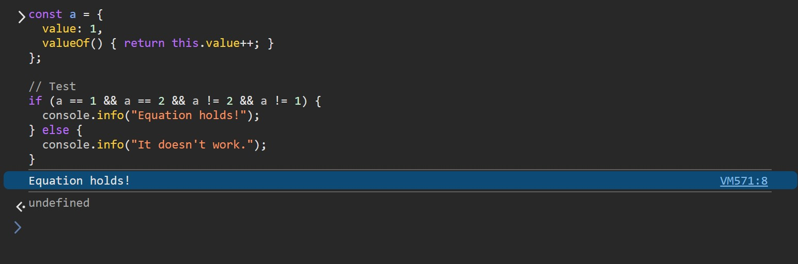

If we were to create an object `a` such that the equation `a == 1 && a == 2 && a != 2 && a != 1` holds true, it sounds bizarre at first, but upon closer thought, it's actually quite easy to achieve.

## Implementation

Without further ado, let's dive straight into the code!

```javascript
const a = {
  value: 1,
  valueOf() {
    return this.value++;
  }
};

// Test
if (a == 1 && a == 2 && a != 2 && a != 1)
  console.info("Equation holds!");
else
  console.info("It doesn't work.");
```

Alright, let's open the browser DevTools, switch to the Console, and paste the code above to run it.



Perfect! The output matches the scenario where the `if (a == 1 && a == 2 && a != 2 && a != 1)` condition evaluates to `true`.

> Equation holds!

## Weakly typed

Actually, many friends who are familiar with JavaScript can instantly understand that the `valueOf()` method is the key behind this "bizarre effect." It is a prototype method of the `Object`, meaning all objects inherit this member method. Of course, we can override this method as needed to return more suitable content. The purpose of this method is to return the primitive value of an object. In scenarios where JavaScript needs to convert an object to a primitive value, such as unary operations and equality comparisons, this function is implicitly invoked internally.

As we all know, JavaScript is a weakly typed language. It has double equals (`==` and its counterpart `!=`) and triple equals (`===` and its counterpart `!==`). The former supports weakly typed equality comparison, which means we can often use values of types different from the expected type. For example, consider the following examples.

```javascript
console.info(1 == "1");   // -> true
console.info(true == 1);  // -> true
```

In fact, this weak typing characteristic is also widely present in other scenarios, such as addition shown below.

```javascript
console.info(1 + "1");    // -> "11"
console.info(true + 1);   // -> 2
console.info(false + 1);  // -> 1
```

The reason JavaScript can handle these different types of values and ultimately produce results that may not align with the intuition of strongly-typed languages is that, before execution, JavaScript converts some of the values into more suitable types according to specific strategies and rules. For example,

- In the first line of the example, `1 + "1"`, the number `1` is implicitly converted into the string `"1"`;
- In the second line, `true + 1`, the boolean `true` is implicitly converted into the number `1`; similarly, in the third line, `false` is converted into the number `0`.

## `Symbol.toPrimitive`

How does JavaScript perform such conversions? First, it determines the most appropriate type based on the current statement and the types of existing variables. It then attempts to invoke the following methods (if available and applicable) in roughly this order:

1. `[Symbol.toPrimitive](hint)`: Attempts to retrieve a value converted to a specific type. By default, this method is not present; if implemented, it must return a primitive value. The `hint` parameter, a string, indicates the desired type and can have the following values:
   - '"default"': This is the usual value, except in the cases below.
   - '"number"': Used during numeric coercion, including unary numeric operations and `Number()`.
   - '"string"':Used during string coercion, including with template literals and `String()`.
2. `valueOf()`: Attempts to retrieve the object's intrinsic value. By default, it returns the object itself. If the return value is a non-primitive type, it will be ignored.
3. `toString()`: Outputs the formatted string representation of the object. This is applicable in limited scenarios.

Let's conduct a few more experiments. First, define an object that includes the aforementioned methods.

```javascript
const a = {
  valueOf() { return 1; },
  toString() { return "b"; },
  [Symbol.toPrimitive](hint) {
    if (hint === "number") return 2;
    if (hint === "string") return "c";
    if (hint === "default") return 3;
    return 4;
  }
};
```

Then, we can observe how JavaScript handles different scenarios. Starting with the equality comparison (`==`), we can see that it prioritizes executing the `[Symbol.toPrimitive]("default")` statement. 

```javascript
console.info(a == 1);   // -> false
console.info(a == "b"); // -> false
console.info(a == 2);   // -> false
console.info(a == 3);   // -> true
console.info(a == 4);   // -> false
```

Next, let's examine the various cases of forced conversion to numbers and strings.

```javascript
// [Symbol.toPrimitive]("number")
console.info(Number(a)); // -> 3
console.info(+a); // -> 3
console.info(-a); // -> -3

// [Symbol.toPrimitive]("string")
console.info(String(a)); // -> "c"
console.info(`${a}`);    // -> "c"

// .toString()
console.info(a.toString()); // -> "b"
```

For other scenarios where conversion to a primitive type is required, the `[Symbol.toPrimitive]("default")` statement is executed.

```javascript
console.info(a + 7);   // -> 10
console.info(a + "!"); // -> "3!"
```

This indicates that `[Symbol.toPrimitive](hint)` has a very high priority, and the parameter passed in various scenarios depends on the specific context. When `[Symbol.toPrimitive](hint)` is absent, the `valueOf()` method becomes the corresponding fallback method.

## `valueOf`

As mentioned earlier, `valueOf()` is a method available to all types, except for `null` and `undefined`. You can find it in all objects. By default, it returns the object itself (`this`), but some types override this method, such as `Date`, as shown below.

```javascript
const today = new Date("2025-10-17T00:00:00Z");
console.info(today.valueOf()); // -> 1760659200000
```

We can also override this method in our own object or class implementation.

```javascript
const a = {
  valueOf() { return 1; }
};
```

Then, we can perform some experiments to verify the behavior. The situation is as follows.

```javascript
console.info(a == 1);    // -> true
console.info(a == true); // -> 1 == true -> true
console.info(a + 1);     // -> 2
console.info(a + "!");   // -> "1!"
console.info(Number(a)); // -> 1
console.info(String(a)); // -> "[object Object]"
console.info(`${a}`);    // -> "[object Object]"
```

It is worth mentioning the last two lines, `String(a)` and the string template `${a}`. Their return value is based on the result of `a.toString()`, but not `String(a.valueOf())`. Even if the `valueOf()` implementation returns a string, the result will still be `"[object Object]"`.

However, if the `toString()` method is implemented, the returned value will be the result of that method call, regardless of the implementation of .

```javascript
a.toString = function () { return "Hi!"; };

// Test
console.info(String(a)); // -> "Hi!"
```

Then let's test the scenario where `valueOf()` returns a complex type. We will find that it essentially behaves as if the method wasn't overridden at all. When forced conversion occurs, the result returned by this method is not adopted, and it is still treated as a regular object.

```javascript
const b = {
  valueOf() { return a; }  
};

// Test
console.info(b.valueOf().valueOf()); // -> 1
console.info(b == a); // -> false
console.info(b == 1); // -> false
console.info(b == b); // -> true
console.info(`${b}`); // -> "[object Object]"
```

## Other way to implement

Therefore, when implementing `a == 1 && a == 2 && a != 2 && a != 1`, aside from the earlier example using `valueOf()`, we can also use `[Symbol.toPrimitive](hint)` to achieve the same effect.

```javascript
const a = {
  num: 1,
  [Symbol.toPrimitive](hint) {
    return this.num++;
  }
};
```

Of course, both implementations (based on `valueOf()` and `[Symbol.toPrimitive](hint)`) have side effects, as even a simple reference can cause changes to the internal content. Hence, they are not commonly used in practice. However, to create this "magical" effect, we implemented it this way to uncover the underlying mystery.

Well, let's continue to explore more exciting aspects derived from this concept!

With the knowledge above, let's try to implement capabilities related to the`Date`  object. As mentioned earlier, the  object overrides the `valueOf()` method and also implements the `[Symbol.toPrimitive](hint)` method.

```javascript
class Date {
  valueOf() {
    return this.getTime();
  }

  [Symbol.toPrimitive](hint) {
    if (hint === "number") return this.valueOf();
    return this.toString();
  }

  // … 其它成员属性和方法，此处略。
}
```

Here's how it works:

- In the `[Symbol.toPrimitive]("number")` scenario, the `valueOf()` member method is called;
- Meanwhile, within `valueOf()`, the `getTime()` member method of `Date` is invoked to return the Tick value based on milliseconds;
- For `[Symbol.toPrimitive]("string")` and `[Symbol.toPrimitive]("default")`, the `toString()` member method is called, which returns the string representation of the date and time.

As a result, we can observe that the  object supports both string and number coercion capabilities in various scenarios. Moreover, its behavior for `default` and string coercion is consistent with each other.

```javascript
const today = new Date("2025-10-17T00:00:00Z");

// [Symbol.toPrimitive]("number")
console.info(Number(today)); // -> 1760659200000

// [Symbol.toPrimitive]("string")
console.info(String(today)); // -> "Thu Oct 16 2025 17:00:00 GMT-0700 (Pacific Time)"

// [Symbol.toPrimitive]("default")
console.info("Today is " + today); // -> "Today is Thu Oct 16 2025 17:00:00 GMT-0700 (Pacific Time)"
```

## `JSON.stringify`

But, the detail-oriented among you may notice that when we serialize a `Date` object, it is also converted into a custom format — specifically, an ISO 8601 standard format string representing a specific date and time.

```javascript
console.info(JSON.stringify(today)); // -> "2025-10-17T00:00:00.000Z"
```

So, what's going on here? 

It turns out that for objects, we can implement their `toJSON()` method. When such an object, or when it is a property of another object, is serialized using `JSON.stringif()`, this method, if present, will be implicitly called first. This method needs to return a value, which can be a simple type (such as a string, boolean, or number) or an object or array. Finally, the serialized result will then be based on this returned value. And the result will be a string.

| Type | The content of string | Result sample |
| ------- | -------------------- | ---------- |
| `null` | `null` | `"null"` |
| `NaN` | `null` | `"null"` |
| `Symbol` | `null` | `"null"` |
| `undefined` | N/A (return `undefined`) | `undefined` |
| `true` | `true` | `"true"` |
| `false` | `false` | `"false"` |
| Number | The decimal digits | `"123"` |
| String | The string escaped | `"\"Hello!\""` |
| Object | The object to stringify | `"{\"value\":100}"` |
| Array | The array to stringify | `"[\"a\"]"` |
| Function | N/A (return `undefined`) | `undefined` |

Following is a sample of which `toJSON()` method returns a JSON object.

```javascript
const a = {
  value: "No this field.",
  toJSON() { // The result is used to serialize instead of the source object itself.
    return { info: "It will serializes as an object with this field." }
  }
};

// Test
console.info(JSON.stringify(a)); // -> "{\"info\":\"It will serializes as an object with this field.\"}"
```

However, please note that if the `toJSON()` method returns an object that also contains a `toJSON()` method, the internal serialization call will not propagate. In other words, the `toJSON()` method of the returned object will not be triggered; instead, it will be serialized directly.

```javascript
a.toJSON = function () {
  return {
    data: "First",
    toJSON() {
      return { data: "Second" };
    }
  }
};

// 测试
console.info(JSON.stringify(a)); // -> "{\"data\":\"First\"}"
```

So, implementing this method for `Date` to return a string in the ISO 8601 standard format that represents the date and time can achieve the effect in real-world scenarios.

```javascript
function numberToStringInternal(value, length) {
  return value.toString(10).padStart(length, "0");
}

class Date {
  toJSON() {
    // {yyyy}-{MM}-{dd}T{HH}-{mm}-{ss}.{sss}Z
    return `${numberToStringInternal(this.getUTCFullYear())}-${numberToStringInternal(this.getUTCMonth() + 1)}-${numberToStringInternal(this.getUTCDay())}T${numberToStringInternal(this.getUTCHours())}:${numberToStringInternal(this.getUTCMinutes())}:${numberToStringInternal(this.getUTCSeconds())}.${numberToStringInternal(this.getUTCMilliseconds())}Z`;
  }

  // … Other member properties and methods are omitted here.
}
```
