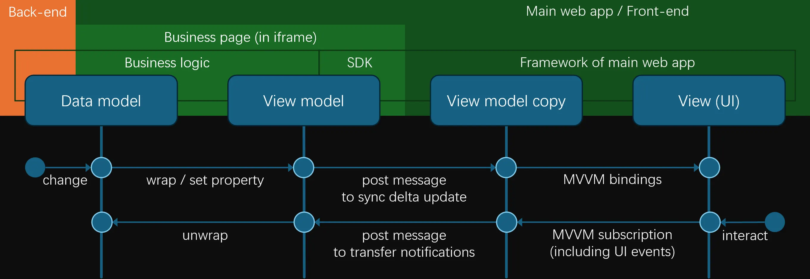
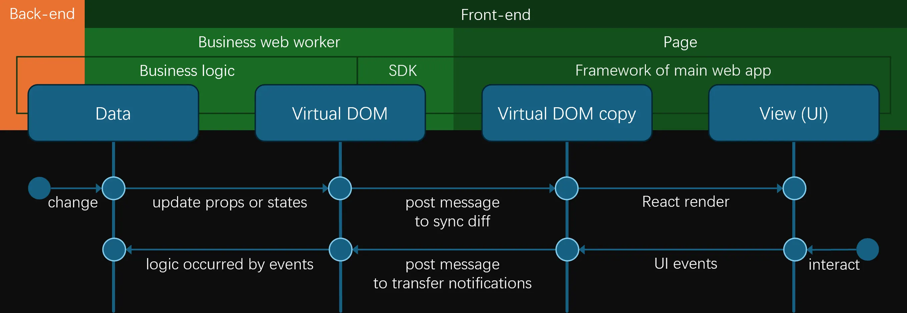

# New solution of micro-frontend

Micro-frontends is a pattern that breaks down various sub-businesses into corresponding independent frontend packages, which are then loaded and rendered by the main web app as needed. To minimize mutual interference, these loaded independent modules are securely isolated from each other and can be independently maintained and developed.

Nowadays, there are numerous micro frontend solutions. Here, I would like to introduce a new implementation approach, which has some connection to the early architectural design of Azure Portal that I was involved in during the early 2010s.

## Background

Micro-frontends draw inspiration from the concept of microservices in the backend, and its development is closely intertwined with the explosive growth of the frontend domain.

### Remarkable but Brief Development

Looking back, you’ll realize that the development of Web front-end has actually not been very long. Both HTML and W3C were born in the 1990s. After Netscape engineers invented JavaScript in 1995, although people foresaw a bright future for front-end web pages, for quite a long time, it remained in what now seems like a rather primitive state. Dynamic pages were mostly rendered using server-side rendering (SSR) techniques. It wasn’t until 1999, when Microsoft integrated the `XHR` component (originally provided as the `XMLHTTP` ActiveX object) into Internet Explorer, that basic data interaction between the front-end and back-end became possible. Later, the Web 2.0 wave popularized this front-end and back-end interaction model, bringing front-end rendering technology to the forefront.

Meanwhile, the MVVM technology (including concepts like two-way binding) introduced in Composited WPF for client-side development was later brought into the Web front-end through the Knockout library. This allowed for the decoupling of data and views while enabling rapid view generation based on data and achieving componentization. Subsequently, more comprehensive and sophisticated frameworks like Angular, React, and Vue emerged, introducing concepts such as one-way data flow, page routing, virtual DOM, and more. These advancements made the implementation of SPA (Single Page Web Applications) much easier.

### Full of Challenges

However, as front-end pages have grown increasingly large and comprehensive, a single front-end package now often encompasses a multitude of business functionalities. The downside of this is that the package size has become larger, loading times longer, and collaboration among teams supporting these various functionalities has become increasingly difficult due to the growing complexity of engineering. Additionally, specific scenarios, such as the integration of third-party businesses, further complicate matters. Ultimately, the demand for separating business functionalities and managing them centrally through the main Web application, with on-demand loading, has emerged within the front-end community.

The solution to this challenge is micro-frontend.

### Solutions

In today's real world, micro-frontend technology is applied in many scenarios, emphasizing independence, composability, autonomy, and isolation, albeit with some trade-offs based on existing web frontend technologies.

Thanks to the support of modern frontend modularization and routing, independent development of respective business modules is not a challenging task. By adhering to the frontend main application framework's declaration conventions for modules, registering and deploying them separately, the main application framework can determine and select the corresponding specific business modules based on user actions or page entries. This is achieved through dynamically inserting script packages for on-demand loading. This part also constitutes an essential aspect of package management in micro-frontend frameworks.

The loaded package is usually assigned a predefined element, i.e., a business view slot, for the frontend logic of the business module to operate. This includes creating child elements and associating event responses. The specific frontend logic is implemented based on the respective business logic, enabling each module to function independently and decoupling the different business modules from one another. Some frontend frameworks may introduce additional tools and constraints based on practical scenarios to facilitate better integration of business frontends under certain standards, but these are targeted optimizations. Overall, micro-frontends impose relatively lenient rules on the business frontends they integrate, even allowing them to choose their own frontend frameworks.

Since frontends typically use webpack or similar methods for bundling, styles and inline SVGs can be integrated into the corresponding frontend package through such engineering approaches. Some frameworks impose conventions on CSS, such as requiring namespaces (e.g., based on the BEM methodology) to prevent style pollution across businesses, as these CSS styles exist at the page level. In addition, using Shadow DOM enables better management of child elements and isolation of CSS, making it another viable solution.

For JavaScript runtime, to prevent mutual interference caused by global object sharing, micro-frontends often introduce sandbox mechanisms. For example, after loading a frontend package, its contents are placed into a context where objects like `window` are rewritten before triggering execution. Below is an example of such code. These patterns may still have areas that require consideration during implementation.

```javascript
export function inject(js: string) {
  const store: Record<string | symbol, unknown> = {
    // Declare and implement the global objects and functions to replace. They are omitted here.
  };
  function get(target: Window & typeof globalThis, key: string | symbol) {
    return store[key] || window[key as any];
  }
  function set(target: Window & typeof globalThis, key: string | symbol, value: any) {
    store[key] = value;
    return true;
  }
  function has(target: Window & typeof globalThis, key: string | symbol) {
    return true;
  }

  (new Function("window", "globalContext", `
    with (globalContext) {
        ${js}
    }
  `))(new Proxy(window, { get, set }), new Proxy(window, { get, set, has }));
};
```

## First Version of Azure Portal

Let's go back to the past, to a time that was long before VS Code existed, though not too far back.

### iframe

In the early days, constrained by factors such as the state of SSR at the time and the encapsulation of frontend components, `iframe` once shone brightly. It offered both isolation and a certain level of cross-accessibility within the same page, making it convenient for frontend developers to achieve localized refresh effects. However, as SSR capabilities improved, the scenarios where `iframe` technology was applicable shrank rapidly. With the increasing sophistication of frontend rendering frameworks, especially the emergence of SPAs (Single Page Applications), `iframe` is now typically used in only a few specialized scenarios.

To some extent, the security isolation properties of `iframe` align well with the goals of micro-frontend architectures. However, it is a relatively heavy solution. Without special handling, `iframe` does not inherently support fluid or responsive layouts within the parent page. Additionally, the rigid boundaries of embedded pages limit the ability to implement features such as modal dialogs or overlays that need to break out of the embedded page to be rendered globally. Consequently, this approach is not commonly used in micro-frontend implementations.

### MVVM

The earliest versions of Microsoft Azure Portal management website employed a micro-frontend architecture that was fundamentally based on `iframe`. However, it did not follow the traditional approach of embedding sub-applications into iframes for page rendering. At that time, React had not yet emerged, and the Azure Portal frontend was developed using the MVVM pattern of Knockout.js. This approach involved using the data model (Model) and view template (View) as the basic building blocks. The data model was wrapped into a ViewModel internally and augmented with reactive listeners for business logic, enabling it to describe the rendering and interaction of the interface. This pattern is somewhat similar to Angular and Vue, though not as feature-rich.

Specifically:

- First, relevant data was retrieved and organized from the backend and the context. Essentially, this data consisted of JSON objects.
- These objects could then be transformed into a ViewModel using a method. This transformation, also known as wrapping, replaced relevant properties with accessors to invoke notification events within the setter logic. (Notably, due to being developed long ago, Knockout did not use `Object.defineProperty` or similar methods to implement accessors. Instead, it aggressively converted properties into methods, so calling a property was effectively invoking a method of the same name.)
- Developers would write view templates, which were HTML template elements containing special attributes and auxiliary elements. These templates described the mapping between certain elements displaying text or specific attributes and the ViewModel, including support for transformations. The templates also defined logic for loops, conditions, and other details to control the specific generation of the view's internal elements. These templates could be represented as strings describing the HTML structure.
- Elements in the view templates could also register custom events, which were associated with the bound ViewModel.
- The Knockout engine would then take the ViewModel and view template to generate the corresponding view and automatically establish listeners. Consequently, when the ViewModel changed, the corresponding view would be notified to update specific parts. Similarly, changes in the view could also reflect back to the ViewModel. If a data model was directly passed, the engine would automatically perform a data-to-view transformation internally to ensure the smooth functioning of the two-way binding logic.

```html
<ul data-bind="foreach: list">
    <li>
        <span data-bind="text: name"></span>
        <span data-bind="text: subname"></span>
    </li>
</ul>
```

```typescript
ko.applyBindings({
  list: [
    { name: "A", subname: "alpha" },
    { name: "B", subname: "bravo" }
  ]
});
```

While this logic is not overly complex, modern frontend frameworks offer more advanced and extensive capabilities to achieve even greater effects. However, this approach had significant advantages for implementing a robust micro-frontend architecture. In Azure Portal, by adjusting the notification listeners within the aforementioned ViewModel, notifications were routed to a unified subscription aggregation module, and these ViewModels were also tagged for identification. Yes, it does sound somewhat like Redux. Ultimately, when a ViewModel changed, whether the change originated from the view or from external sources, it would pass through this centralized subscription aggregation module. Since custom events were also associated with the ViewModel, related events were similarly routed through this system. 

So why was this unified subscription aggregation module created?

### iframe with New Technology

In the main web app of Azure Portal, based on user access to the business, corresponding information is read from the registered business configuration manifest. This information contains an online webpage address, which can belong to a different domain, allowing external third-party pages. This page is a standard HTML page, but it does not need to present any business-related views, as it will be loaded in an invisible `iframe`. The page is required to reference a set of SDKs officially provided by Azure. These SDKs include the aforementioned mechanism and provide the current session context information from the Azure Portal main web app through the `onmessage` method. The business needs to rely on this SDK to implement its own functionality using JavaScript, including front-end and back-end data interactions. Since the page itself does not need to share the same domain as the Azure Portal, it can belong to the business owner’s (even an external third party’s) domain. Considering that, at the time, JSONP was the only viable solution for CORS issues, this approach also conveniently addressed cross-domain problems. Even today, this approach helps mitigate cross-domain security concerns on the back end. Once the business retrieves the relevant data, it transforms the data into the desired view model required for the view template, attaches any necessary events, registers the corresponding listeners and handlers, and sends the relevant data back to the back end during these events and other processes. Subsequently, it retrieves the resulting data based on the business logic, converts it into a view model for the front end, and repeats this process, forming a complete front-end and back-end data interaction cycle.

These data and the final rendered view model seemingly serve no direct purpose because the embedded business page itself will not be displayed. However, the business still needs to provide the view template to Knockout, or more precisely, to the SDK. Once the SDK obtains the view model and view template, it does not render them on the current page. Instead, it sends them to the host page (i.e., the main web app) via the post message mechanism. Upon receiving these two sets of data for the first time, the main web app converts the view model JSON back into a view model and, along with the view template, renders them into the designated view slot for the business. As a result, the interface is displayed in the main web app according to the business’s expectations. This interface is rendered and controlled by the main web app, while the business page remains in the `iframe` and cannot directly access it.

When the interface elements change, due to the influence of MVVM, these changes are reflected in the view model. The changes to the corresponding properties in the view model are then aggregated through the unified subscription module of the main web app and sent back to the corresponding `iframe` using the post message mechanism. The unified subscription module in the SDK imported by the business page responds to these updates. Consequently, the original properties of the view model in the business page are updated, triggering the business logic and further interactions associated with the changes to those properties. Similarly, changes to the properties of the view model triggered within the business page are notified through the unified subscription module in the business page. These changes are then sent to the unified subscription module in the main web app via the post message mechanism, accurately updating the main web app’s copy of the business’s view model and triggering the corresponding real view updates. As a result, users see partial updates to the page content. Regular events triggered by user operations are also captured through the view model registration methods in the main web app and ultimately reach the original event handlers in the business page via this communication chain. Through the connection established by the main web app and the SDK in the business page, the main web app’s views, the business page’s view model, and the back-end services behind it are seamlessly linked.



The content transmitted via the post message primarily includes changes to the view model and any newly used view templates. The reverse transmission mainly consists of subscription information.

## Back to Today

Using history as a mirror can help us understand the insight into the possibilities of the present.

### Difference

More than a decade later, with the emergence and development of new frontend frameworks, the situation seems to have changed.

- The relatively simple Knockout model of the past no longer seems viable in the modern framework landscape dominated by React, Angular, and Vue. This is because the relationship between the view template and the data has become more complex. Additionally, some of the logic that used to reside in the view template has gradually shifted towards being controlled by code logic. As a result, the view template can no longer be expressed as a string representation, making it impossible to pass across `iframe`.
- On the other hand, the built-in support for some foundational frontend capabilities in browsers has been significantly enhanced. Coupled with the application of other frontend technologies, we now have some means to achieve equivalent results in a more elegant and efficient manner.

So, let's try to make some assumptions and explore whether we can use more modern methods and contemporary frontend infrastructure to achieve a more thorough implementation of micro-frontends. The following discussion is based on the technologies available today. In the future, as technology continues to evolve, there may be more foundational capabilities and tools to provide better support, thereby simplifying these implementation processes. However, that is beyond the scope of this article.

### Virtual DOM

Let's take React as an example.

```tsx
interface NameValueComponentProps {
  name: string;
  value: string[];
}
function NameValueComponent({ name, value }: NameValueComponentProps) {
  return <dl>
    <dt key={"name"}>{name}</dt>
    {
      value.map((item, i) => (
        <dd key={`item-${i}`}>{item}</dd>
      ))
    }
  </dl>;
}
```

We usually write some function components that return a Virtual DOM tree using JSX/TSX syntax. The structure of this tree is typically generated by a series of code logic, and without considering passing the source code between processes, it seems unlikely to convert it into a string.

However, internally, React replaces the part of the JSX syntax that generates nodes with calls to the `React.createElement` function. It then constructs an information structure based on JavaScript to store these nodes, which is referred to as the Virtual DOM. Subsequently, during the next rendering cycle, changes in the Virtual DOM are reflected in the real DOM. In fact, to improve performance, React employs strategies, including diffing, to extract only the modified parts and execute updates in batches accordingly.

Here, we can observe that the rendering process within React is essentially about changes to the Virtual DOM tree. This tree is essentially a data structure that contains information about the type of the Virtual DOM and its props. The changed parts are primarily the local components of the tree related to the modification, along with some additional information about the state of the changes. By traversing and copying the members of this change data structure, it is transformed into a simplified copy. During this process, non-simple structures within the tree, such as functions, can be converted into unique identifiers. This simplified copy can then be serialized and transmitted via postMessage.

In the main web app, you can listen to this event, and within the React component slot reserved for this business logic, the specific rendering operation can be executed.

This process is similar to the early implementation of the Azure Portal mentioned earlier, except that React replaces Knockout, and the transmitted information changes from view templates and view models to internal change description structure in React. On the business frontend, React no longer needs to render directly on the real `document`; this process is handled by the main web app, while other processes remain unchanged. On the main web app side, state changes triggered by React components are also sent back to the React processing flow in the business frontend through a similar postMessage mechanism. This may eventually trigger the reactive logic within the React components in the business frontend, potentially leading to new renders, which then continue the aforementioned process, rendering within the component corresponding to the business in the main web app.

### Web Worker

However, the business frontend no longer needs to be placed inside an `iframe`. In the browser, apart from some interface controls, an `iframe` instance is essentially similar to opening a new tab, containing multiple sets of logic such as JS execution and rendering. Since the business frontend does not require actual rendering in the current process, at the very least, the rendering of the page corresponding to the `iframe`, or the `document` part, is actually unnecessary. In fact, modern browsers provide a mode that allows JS to run independently without a visual interface.

The new way is to use web worker.

The information exchange mechanism between the web worker and the main interface still supports the post message format. Therefore, in the previous React model, communication between the business frontend and the main web app can continue to function normally. The business frontend simply resides in the browser as a business worker, in a very pure form. Since the web worker runs in an independent thread, it avoids thread-level blocking issues between itself and the main web app thread caused by load. From an on-demand loading perspective, creating a web worker is relatively simple and controllable, making micro-frontend package management easier to implement.



The content transmitted via post message primarily includes the changes in the Virtual DOM (including props and states), while the reverse transmission carries event information. However, due to the additional cross-thread relay based on post message, the performance in some aspects is naturally less efficient compared to the original React model. Nonetheless, this solution inherently possesses advantages in terms of security and isolation.

### Shadow DOM

So how should styles be handled? Mature solutions can still be used, such as convention-based namespaces or Shadow DOM.

If Shadow DOM is used, a unified React component can be customized within the main web app and encapsulated into a Shadow DOM. This serves as the root node of the business view slot. The Shadow DOM element and its internal React components receive notifications routed and mapped by the main web app based on the web worker, including the initialization of styles and other information at the start, as well as subsequent React Virtual DOM change events that trigger actual UI layer updates. As a result, the interface rendering part is completely isolated, with its encapsulation and external interaction fully managed by the main web app. Meanwhile, all business logic resides within the Shadow DOM, ensuring no interference with external elements.

### Bring It to Reality

However, there is a rather practical issue: while theoretically feasible, React does not seem to provide an entry point that allows us to take over control of the logic related to Virtual DOM and state responses. This would enable us to integrate the entire workflow into a design scheme where the work service and page synchronization are separated. It seems that the only way to achieve this mechanism is to submit a merge request to directly modify React internal structure, which is essentially what is referred to as native micro-frontend technology for React.

What about other frameworks?

- For Angular, isolation can be handled between the view layer and the view model.
- For Vue, since it also has a Virtual DOM, processing can be done there.

Of course, there is undoubtedly a lot of targeted adaptation work to be done, and it seems that each framework requires its own handling.

Additionally, this micro-frontend solution has a limitation: it is tied to the frontend framework. The business frontend package must use the same frontend framework as the main web app, and the version of the main web app cannot be lower than that of the business (unless new features are not utilized). However, this issue might be relatively manageable in practice, as the solution offers many clear advantages. It truly achieves frontend logic isolation: JavaScript runs in independent threads; global objects do not interfere with each other; styles are isolated; on-demand loading is supported; and it features convenient and comprehensive micro-frontend package management. Moreover, these isolations are native, fully leveraging existing browser technology, making it highly pure.
