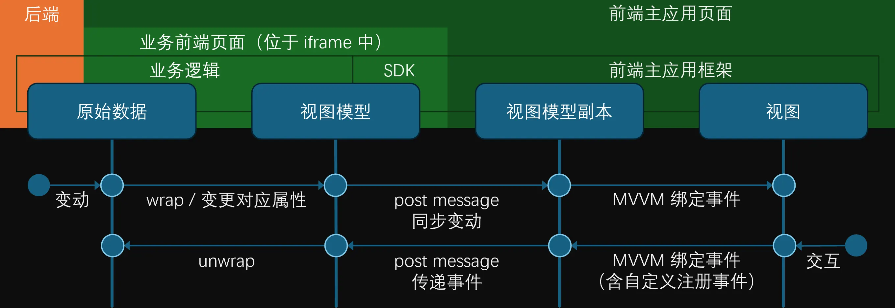
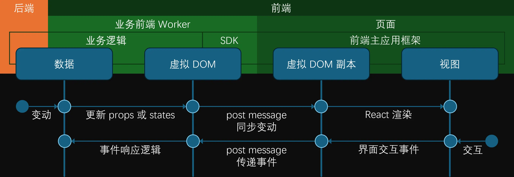

# 微前端实现的另一个思路

微前端是一种将许多子业务拆散到对应不同的前端包，并由前端主应用按需载入进行运行呈现的一套模式。为减少相互影响，这些被载入的独立模块之间会被进行安全隔离，且各自均可独立维护开发。

如今的微前端方案有许许多多。在此抛砖引玉介绍一个新的实现思路，与本世纪10年代初本人曾参与的 Azure Portal 的早期架构设计有一定关系。

## 背景

微前端借鉴了后端的微服务概念，它的发展源自于前端界近年的突飞猛进。

### 不长但惊人的发展

仔细回忆一下你会发现，Web 前端的发展其实并不是很久，HTML 和 W3C 均诞生于上世纪90年代。自1995年 Netscape 工程师发明 JavaScript 后，虽然人们看到前端网页未来光明的前景，但实际在相当长一段时间内都基本都停留在在现在看来相当原始的状态，动态页面基本由服务器渲染技术（SSR）输出；直到1999年微软在 IE 中集成了 `XHR` 组件（最初为 `XMLHTTP` ActiveX 对象提供），使得我们可以通过前端与后端进行基本的数据交互；再之后，Web 2.0 浪潮让这种前后端交互模式更为普及，前端渲染技术崭露头角。

同时，Composited WPF 中在客户端开发引入的 MVVM 技术（含双向绑定等概念），而后通过 Knockout 前端库引入到了 Web 前端，让数据与视图解耦，同时又能依托数据快速生成视图并实现组件化；再之后，包括 Angular、React 和 Vue 等更多更全面更复杂的框架出现，以及一并引入的像单向数据流、页面路由、虚拟（Virtual）DOM 等一系列前端概念，让 SPA（单页面 Web 应用）的实现更为轻松。

### 充满挑战

然而，随着前端页面愈发包罗万象般地庞大起来，一个前端包即包含大量业务。这样带来的缺点是，其尺寸也越来越大、加载时间也越来越长，同时，分别支撑这些业务的各团队之间，因工程的日益复杂化，合作起来也越来越困难。再加上一些特定场景的其它因素，例如第三方业务的嵌入等。最终，重新将业务分离，由 Web 主应用来统一管理，按需加载的模式，便成为前端界的述求。

对此的解决方案，便是微前端。

### 成熟方案

当今现实世界中，微前端技术应用于许多场景，他们强调这独立性、组合性、自治性和隔离性，但基于现有 Web 前端技术，多少有所取舍。

受益于现代前端模块化和路由化的支持，各自业务的独立开发并不是一件难事。而遵循前端主应用框架对模块的声明约定，而分别进行注册与部署后，前端主应用框架便能够根据用户操作或页面进入等条件，判断选择对应的具体业务模块，通过动态插入脚本包的方式，实现按需加载。其中这一部分，也是微前端框架中包管理的重要部分。

所加载的包，通常会给定一个预设的元素，即业务视图插槽，供业务模块前端逻辑发挥，包括创建子元素和关联事件响应等，其中具体的前端逻辑依据所属业务逻辑而实现，从而各自为政，各业务之间互相解耦。一些前端框架也会根据实际情况增设一些工具和限制，方便业务前端在一定的标准下能更好的接入，但这些属于定向优化。整体而言，微前端对具体接入的业务前端所设定的条条框框都较为宽泛，甚至允许其自行选择相关前端框架。

由于前端通常采用 webpack 或类似方式进行打包，一些样式和内联 SVG 可通过此类工程化的方式集成至对应的前端包中。一些框架会对 CSS 进行约定，例如需要添加命名空间（例如基于 BEM 规范）来防止跨业务间的样式污染，毕竟这些 CSS 是会以页面级存在的。除此之外，通过 Shadow DOM 的方式，能更好地将子元素管理和 CSS 进行隔离管理，因此也是一种方案。

而对于 JS 运行时，为了防止全局对象共享导致的相互影响，通常微前端会引入沙箱机制，例如在加载前端包后，将其内容放入对 `window` 等对象改写后的上下文中，再触发运行。如以下代码示例。这些模式有时可能依然存在考虑步骤的地方。

```javascript
export function inject(js: string) {
  const store: Record<string | symbol, unknown> = {
    // 可在此处声明和实现需要替换的全局对象，此处略。
  };
  function get(target: Window & typeof globalThis, key: string | symbol) {
    return store[key] || window[key as any];
  }
  function set(target: Window & typeof globalThis, key: string | symbol, value: any) {
    store[key] = value;
    return true;
  }
  function has(target: Window & typeof globalThis, key: string | symbol) {
    return true;
  }

  (new Function("window", "globalContext", `
    with (globalContext) {
        ${js}
    }
  `))(new Proxy(window, { get, set }), new Proxy(window, { get, set, has }));
};
```

## Azure Portal 的童年

让我们又回到从前，在那个 VS Code 还没问世的很早但其实也没那么早的年代。

### iframe

在早期，受制于 SSR 彼时状态和前端组件封装等因素限制，`iframe` 曾大放异彩，其既具有隔离性，又具有同页面一定权限下的互访问性，方便前端实现一些具有局部刷新能力的效果。随着 SSR 的增强，`iframe` 技术适用的场景也就急剧缩小；而当前端渲染框架的日趋完善，尤其是 SPA 的出现，`iframe` 通常只存在于极少数的特殊场景。

从某种程度上说，`iframe` 的安全隔离性质，其实很符合微前端述求的。然而，它是一个较重的方案；且在未经特殊处理的前提下，其自身在父页面中是不支持流式等自适应布局的；以及内嵌页在呈现上的边界过于固化，而限制了诸如弹窗浮层一类希望跳出当前内嵌页在全局进行呈现。最终，这套方案在微前端方案中并不常见。

### MVVM

微软的 Azure Portal（即微软公有云控制台管理站点）的最早期版本，其微前端方案其实底层是基于 `iframe` 的。不过，并不是将这些子业务放进 `iframe` 来进行页面呈现的传统方式。那时 React 尚未问世，Azure Portal 前端基于 Knockout 的 MVVM 模式开发，这种模式是采用将数据模型（model / data model）和视图模板片段（view / view template）两部分作为基本构成部分，并通过对数据模型在内部包装成视图模型（view model），同时根据业务赋予一些监听响应，从而完成对界面渲染和交互的描述。该模式与 Angular 和 Vue 较为类似，只是功能没那么丰富。

具体说来，

- 我们先从后端和上下文中获取和整理相关数据，这些数据本质上是一些 JSON 对象。
- 可以将这些对象通过一个方法，转化为视图模型。这个转化也称为 wrap，只是将相关属性替换为访问器，以在 setter 逻辑内部实现对通知事件的调用。（实际上，Knockout 因实现的年代久远，并未通过使用 `Object.defineProperty` 或类似方式来重新实现访问器，而是颇有激进侵入性地将属性变更为方法，从而在调用属性时改为调用同名方法。）
- 我们编写一些视图模板，这些模板是一些具有特殊属性和辅助元素的 HTML 模板元素。模板里描述了其中一些元素呈现文本或特定属性，与视图模型之间的映射关系，包括支持进行一些转化；模板也描述了一些诸如循环和判断等相关的逻辑，用于控制视图内部细节的具体生成。这个模板可以是表述该 HTML 内容的字符串形态。
- 视图模板中的元素也可以注册一些自定义事件，这些事件也会关联在绑定的视图模型中。
- Knockout 引擎接受视图模型和视图模板，从而生成对应的视图，并自动建立一些监听，从而在视图模型变化时，通知对应的视图进行局部变更，同样，视图的一些变更，最终也可能会反映到视图模型中。如果直接传入数据模型，那么会在引擎内自动进行一次数据视图的转化，从而确保整个双向绑定逻辑的顺利完成。

```html
<ul data-bind="foreach: list">
    <li>
        <span data-bind="text: name"></span>
        <span data-bind="text: subname"></span>
    </li>
</ul>
```

```typescript
ko.applyBindings({
  list: [
    { name: "A", subname: "alpha" },
    { name: "B", subname: "bravo" }
  ]
});
```

以上逻辑并不复杂，现代前端框架拥有更为先进和丰富的能力来实现更多的效果。但这种方式，却对于实现一个完美微前端却有非常显著的优势。在 Azure Portal 中，通过对上述视图模型中监听通知进行调整，使通知被路由映射到一个统一的订阅汇聚模块中，同时对这些视图模型进行标识。嗯，听起来有那么一点像 Redux。最终，当视图模型发生变化时，无论是来自视图还是来自外部，都会经过这个统一的订阅汇聚模块。自定义事件由于也是关联在视图模型中的，因此相关事件也被进行类似的路由处理。那么为什么要创建这样一个统一的订阅汇聚模块呢？

### iframe 装新酒

在 Azure Portal 的前端主应用中，根据用户对业务的访问，会从注册的业务配置清单中读取对应的信息，该信息包含一个线上网页地址，该地址可以是不同域名，即允许外部第三方页面。这个页面是个标准的 HTML 页面，但里面不需要呈现任何有业务信息的视图，因为这个页面会在一个肉眼看不到的 `iframe` 中加载。这个页面中会被要求引用 Azure 官方提供的一套 SDK，该 SDK 即包含上述机制，以及从 Azure Portal 前端主应用中通过 `onmessage` 的方式获取当前会话的上下文信息。业务需要依托该 SDK 用 JS 实现自身的业务，包括前后端的数据交互。由于页面本身无需与 Azure Portal 同域名，因此可以是业务所有者（哪怕是外部第三方）的域名，考虑到彼时除了 JSONP 外并无更好的 CORS 方案，由此还顺便解决了跨域问题，但即便是今天，这也对后端收拢跨域安全问题有一定的帮助。业务在获取到相关数据后，转化成预期视图模板所需视图模型，并附上可能需要的任何事件，以及注册好对应的监听和处理逻辑，并在这些事件和其它流程中，将相关数据发送回给后端，而后又根据业务逻辑将后续数据拿到前端并转成视图模型，以此往复，构成一整套前后端数据交互。

这些数据以及最终呈现的视图模型，似乎并不会其任何作用，因为业务的内嵌页并不会被呈现。但业务依旧需要将视图模板一并提供给 Knockout，或者更确切的说，是给 SDK。然而，SDK 获取到这些视图模型和视图模板后，并不会在当前页面进行渲染，而是通过 post message 机制，发给宿主页面，也就是前端主应用。这两组数据，其中视图模型会转化为普通 JSON，而视图模板会转化为字符串形式，以确保在底层是能够真实发送的。前端主应用首次收到后，将视图模型对应的 JSON 重新转化为视图模型，连同视图模板，一起渲染到预期呈现该业务的视图插槽中，于是，在前端主应用中，按照业务的预期，呈现出了界面。这界面是前端主应用渲染和控制的，业务页面依然在 `iframe` 中，无权直接访问。

当该界面元素发生变化时，受 MVVM 影响，其会反应到视图模型中，而视图模型中相对应属性的变化，则会经过前端主应用的统一订阅汇聚模块，随后又通过 post message 的方式，发送回给对应的 `iframe`，并由业务页面中引入的 SDK 内的统一订阅汇聚模块响应，最终结果是业务页面中原本的视图模型对应的属性被触发了更新，并进而引发业务页面中对该属性变化的监听的业务逻辑和进一步的其它联动。同样的，由业务页面中引发的视图模型的属性变动，其事件通知也会经过业务页面中的统一订阅汇聚模块，而后又通过 post message 的方式发给前端主应用中的统一订阅汇聚模块，并精准更新了前端主应用中该业务的视图模型副本，并进而触发对应的真实视图更新，于是用户看到了页面内容的局部更新。而用户的操作引发的普通事件，也通用通过前端主应用相关的视图模型注册方法所捕获，并通过该链路最终抵达业务页面中原始的事件响应函数。所有的界面交互，经由这前端主应用和业务页面 SDK 串联起来，前端主应用的视图，与业务页面的视图模型及其背后的后端服务，隔空联动了起来。



其中，post message 传递的内容，主要是视图模型的变动部分，以及可能的新使用的视图模板，反向传递的则是订阅信息。

### 小结

简而言之，该微前端的原理如下。

- 通过隐藏的 `iframe` 加载业务页面，其核心在于脚本而不在于页面，脚本与后端通信，并用于创建视图模板和视图模型，相关内容及后续变动通过订阅机制汇总收集，并发送至宿主页面，并由该处前端主应用接受后，执行实际的渲染和更新；
- 同时，界面收到交互响应并导致视图模型变动，或触发自定义事件，序列化后发回给内嵌页，并最终路由同步至对应的原始视图模型，或是触发对应函数。
- 通过对视图模型及其订阅机制进行特别处理，包括在统一的地方实现订阅汇聚，以便完成序列化和发送，以及反向的接收和反序列化，并继续衔接既有流程，来实现两边的状态同步。

各业务页面相互隔离，也与主应用隔离，其 `window` 等对象都在其内嵌页内部作用域中，甚至源和 cookie 等关键信息也是隔离的。

## 再回今日

以史为镜可以知兴替。也不一定是兴替这么夸张，但或许可以洞悉一下当下可能的可能。

### 不同之处

十多年后的今天，伴随着新式前端框架的出现和发展，情况似乎有所不同。

- 旧有的相对简单的 Knockout 模式，在 React、Angular 和 Vue 等为主的现代框架模式下，似乎已经行不通了，因为视图模板与数据之间的关系变得更为复杂，且原先视图模板中的一些逻辑，一部分也逐渐更倾向代码逻辑控制，最终的结果是，视图模板无法转化为字符串的表达方式，从而无法跨越 `iframe` 进行传递。
- 而另一方面，浏览器内建支持的一些前端基础能力也得到了大量补充，以及一些其它前端技术的应用，使得我们也有一些手段，可以以更优雅高效的方式，实现等效结果。

那么，我们来尝试着做一些设想，看还能不能用更现代的方式，在更现代的前端基建上，实现更为彻底的微前端。以下是建立在今天已有的技术之上的探讨；未来，随着技术的进一步发展，可能会有更多基础能力和工具来做到更好的支撑，从而更简化这些实现过程，但不在本文范围中。

### 虚拟 DOM

让我们以 React 为例吧。

```tsx
interface NameValueComponentProps {
  name: string;
  value: string[];
}
function NameValueComponent({ name, value }: NameValueComponentProps) {
  return <dl>
    <dt key={"name"}>{name}</dt>
    {
      value.map((item, i) => (
        <dd key={`item-${i}`}>{item}</dd>
      ))
    }
  </dl>;
}
```

我们通常会写一些函数式组件，里面通过 `return` 返回一些 JSX/TSX 语法的虚拟 DOM 树，其结构通常是由一系列代码逻辑控制生成的，在不考虑之间传递源码的前提下，看起来不太可能转为字符串。

然而，React 内部会将 JSX 语法中生成节点的部分替换为调用 `React.createElement` 函数，并在内部构件一个基于 JavaScript 结构的信息，存储这些节点，此谓之虚拟 DOM。而后，在下个渲染周期时，会将这些虚拟 DOM 的变更，反映到真实 DOM 中。实际上，为了提升性能，React 在执行更新时，会依据包括 diff 在内的一些策略，只提取有改动的部分分批依此执行。

在这里其实可以看到，React 内部在执行渲染的过程，其实是关于虚拟 DOM 树的变更，此树本质上是一个结构体，结构体中包含了虚拟 DOM 的类型和 props 等信息，而变更部分则主要是树中的局部组成部分，即与变更有关的那一部分，再外加一些变更状态信息等，所以也是一个描述变动内容的结构体。通过遍历并复制该变动结构体中的成员，将其转化为一个简化副本，再此过程中将其内部包含的诸如函数等非简单结构可转化为唯一标识，随后就能将这个副本进行序列化并进行 post message 传输了。

在前端主应用中，可以监听这个事件，并在其内部为此业务预留的 React 组件插槽内，即可执行具体的 render 操作了。

这个过程和前面提到的早期 Azure Portal 的工作原理类似，只是 Knockout 换成了 React，其内部传递的信息由视图模板和视图模型，变为了 React 内部的变更描述结构体。在业务前端中，React 不再需要在真实 `document` 上进行绘制，该流程被前端主应用执行了，但其它流程保持不变。在前端主应用侧，React 组件所触发的 state 等变动，也以类似机制，通过 post message 的方式传回到业务前端引入的 React 的处理流程中，最终可能会触发业务前端中 React 组件中的响应逻辑部分，并可能进一步触发新的渲染，再继续以前述流程，在前端主应用中该业务对应的组件中渲染。

### Web worker

然而，业务前端不再需要放在 `iframe` 中了。浏览器中，除了一些界面控制外，`iframe` 示例本质上和新起了一个网页 Tab 区别不是很大，包含了 JS 执行和渲染等多套逻辑。既然业务前端在当前的进程中无需真实触发渲染，那么至少 `iframe` 中对应的页面渲染，或者说 `document` 部分，其实是不需要的。实际上，现代浏览器也提供了这样一种无界面但能独立运行 JS 的模式。

这就是 web worker。

其与主界面之间的信息交互机制中，也依然支持 post message 这种形式。因此，前面 React 模式中，业务前端和前端主应用之间的通信依旧能正常工作。只不过，业务前端是以业务 Worker 的形式驻留在浏览器中，非常纯粹。由于 web worker 是运行于独立线程的，因此与前端主应用所在的线程之间，不会存在因负载原因而互相线程级阻塞对方的现象。从按需加载角度看，创建 web worker 也较为简便和可控，因此微前端包管理也会相对容易实现。



其中，post message 传递的内容，主要是虚拟 DOM（包括状态在内）的变动部分，反向传递的则是事件信息。当然，由于多了一层基于 post message 的跨线程中转的过程，一些方面上的性能肯定是比原始 React 模式效率较低。但这套方案，的确在安全隔离等方面的优势是与生俱来的。另外，如果还是希望在 web worker 和页面间有更低延迟，也可以考虑使用 `SharedArrayBuffer` 代替 post/on message 机制。

### Shadow DOM

那么样式如何处理呢？可以继续使用当下成熟的方案，包括约定式命名空间，或者使用 Shadow DOM。

如果使用 Shadow DOM，那么，可以在前端主应用中，定制一个统一的 React 组件，并封装成 Shadow DOM，此即业务视图插槽的根节点。该 Shadow DOM 元素及其内 React 组件，接受经前端主应用收到 web worker 并按业务映射路由后的通知，包括起始时样式等初始化信息的接入并组装，以及后续 React 虚拟 DOM 变更事件的实际 UI 层触发执行。由此，界面渲染部分也都被完整进行了隔离，其隔离的封装及外部交互，均由前端主应用负责实施，而业务部分全都在 Shadow DOM 内部，不会与外部产生干扰。

### 只欠东风

然而，有颇为现实的问题，就是理论上能行，但 React 似乎并没有开放这样一个入口，允许我们对虚拟 DOM 及 state 响应等逻辑进行接管控制，从而将整体链路串联到 work service 与页面分离同步的设计方案上。似乎，只有提 MR 直接修改 React 内部，在其自身才能实现这套机制，所谓 React 原生微前端技术是也。

那么其它框架怎么办？

- 对于 Angular，可在视图层和视图模型之间进行隔离处理。
- 对于 Vue，其也有 Virtual DOM，可以在此进行处理。

当然，这中间肯定还有许多针对性的适配工作要做，而且，似乎这些框架也都需要各自进行处理。

除此之外，此微前端方案有个限制，即存在前端框架绑定的问题：业务前端包必须与主应用共用相同的前端框架，且主应用的版本不能低于业务（除非未用到新特性）。当然，这个问题或许在现实中还好解决，毕竟它还有许多明显优势，即真的做到了前端逻辑的隔离：JS 运行于独立线程；全局对象互不影响；样式隔离；按需加载，便捷完善的微前端包管理。而且，这些隔离还是原生的，充分利用浏览器已经存在的技术，非常纯粹。
